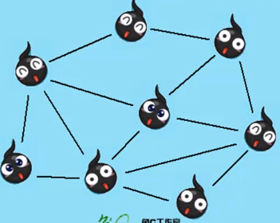

# 数据结构与算法绪论

## 什么是数据结构？

**程序设计 = 数据结构 +算法**

数据结构就是关系，元素相互之间存在的一种或多种特定关系的集合

## 逻辑结构和物理结构

数据结构分为逻辑结构与物理结构

### 逻辑结构

逻辑结构是指数据元素之间的相互关系

集合结构：数据元素除了同属于一个集合外，他们之间没有任何关系

线性结构：数据元素之间的关系是一对一的

树形结构：数据元素之间存在一对多的层次关系

图形结构：数据元素之间是一对多的关系(六度空间理论)

### 物理结构

数据的逻辑结构在计算机中存储的形式

顺序存储：把数据元素存放在地址连续的存储单元里面，其数据间的逻辑关系和物理关系是一致的。(排队)

链式存储：是把数据元素存放在任意的存储单元里，这组存储单元可以是连续的，也可以是不连续的。(医院叫号系统)

