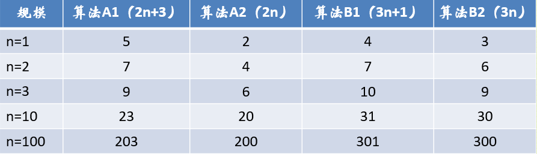
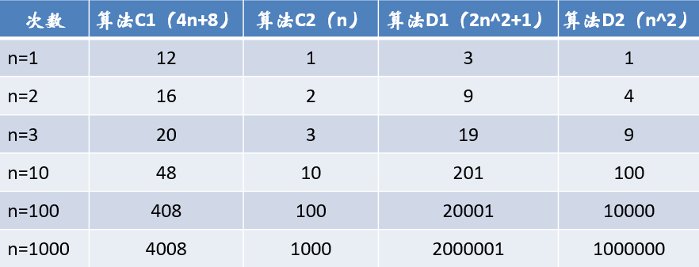
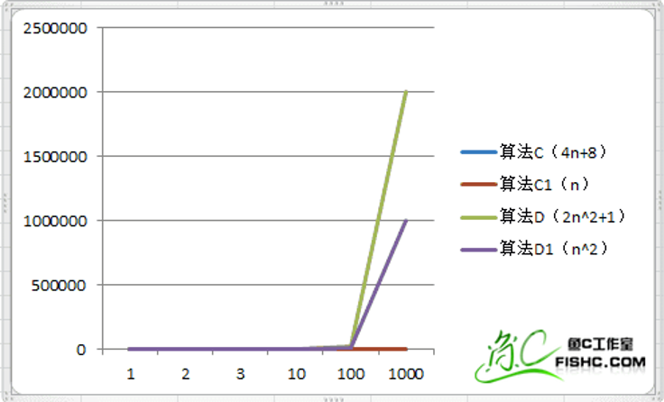
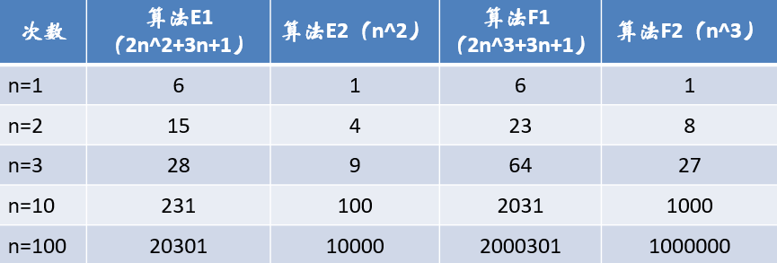
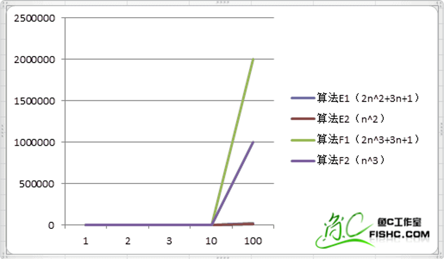
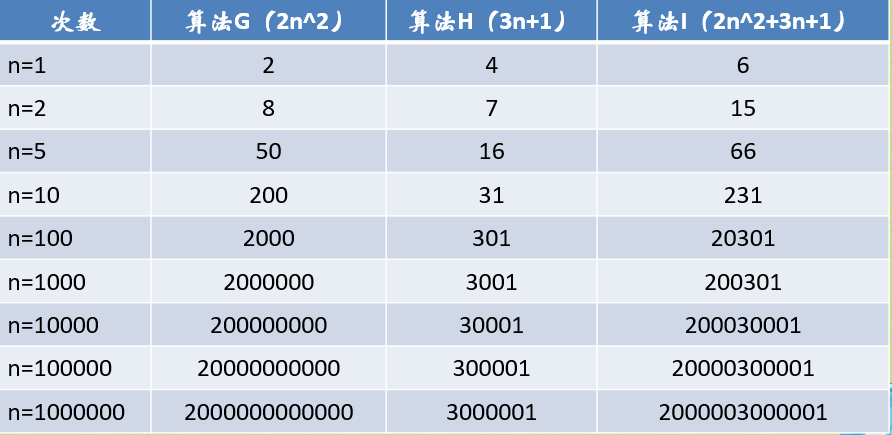
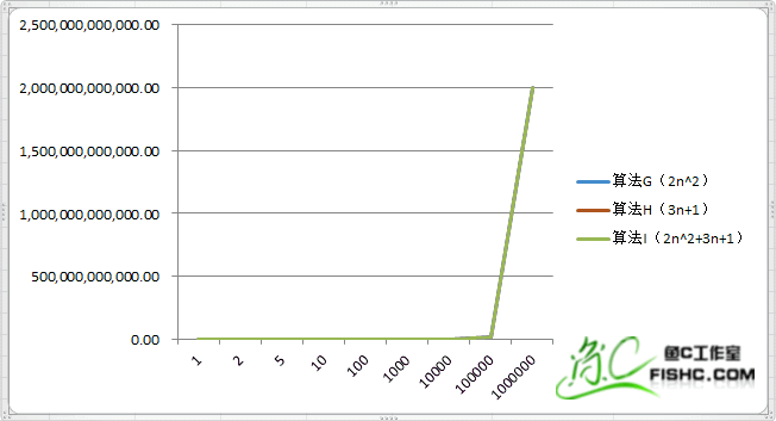

#  时间复杂度和空间复杂度1
## 算法效率的度量方法
### 事后统计方法
这种方法主要是通过设计好的测试程序和数据，利用计算机计时器对不同算法编制的程序的运行时间进行比较，从而确定算法效率的高低。
* 缺陷：
    * 必须依据算法事先编制好测试程序，通常需要花费大量时间和精力，完了发觉测试的是糟糕的算法，那不是功亏一篑？赔了娘子又折兵？
    * 不同测试环境差别不是一般的大！
### 事前分析估算方法
在计算机程序编写前，依据统计方法对算法进行估算。
* 高级语言编写的程序在计算机上运行时所消耗的时间取决于下列因素：
    * 算法采用的策略，方案
    * 编译产生的代码质量
    * 问题的输入规模
    * 机器执行指令的速度
    

一个程序的运行时间依赖于算法的好坏和问题的输入规模。

* 第一种算法

`sum,n = 0,100
for i in range(n+1):
    sum = sum + i
print(sum)
`

* 第二种算法

`sum , n  =  0,100
sum  = (1+n)*n/2
print(sum)`

我们研究算法的复杂度，侧重的是研究算法随着输入规模扩大增长量的一个抽象，而不是精确地定位需要执行多少次，因为如果这样的话，我们就又得考虑回编译器优化等问题，然后，然后就永远也没有然后了！
所以，对于刚才例子的算法，我们可以果断判定需要执行100^2次。

在分析程序的运行时间时,不计那些循环索引的递增和循环终止条件、变量声明、打印结果等操作。最重要的是把程序看成是独立于程序设计语言的算法或一系列步骤。把基本操作的数量和输入模式关联起来。
## 函数的渐近增长
### 测试1
假设两个算法的输入规模都是n，算法A要做2n+3次操作，你可以这么理解：先执行n次的循环，执行完成后再有一个n次的循环，最后有3次运算。

* 当n=1时，算法A1效率不如算法B1；
* 当n=2时，两者效率相同；
* 当n>2时，算法A1就开始优于算法B1了，随着n的继续增加，算法A1比算法B1逐步拉大差距。
* 所以总体上算法A1比算法B1优秀。

* 函数的渐近增长：给定两个函数f(n)和g(n)，如果存在一个整数N，使得对于所有的n>N，f(n)总是比g(n)大，那么，我们说f(n)的增长渐近快于g(n)。

* 随着n的增大，例如算法A2，B2，在图中他们压根儿被覆盖了。所以，我们可以忽略这些加法常数。

  

### 测试2

* 哪怕去掉与n相乘的常数，两者的结果还是没有改变，也就是说，与最高次项相乘的常数并不重要，也可以忽略。

### 测试3

* 我们通过观察又发现，最高次项的指数大的，函数随着n的增长，结果也会变得增长特别快。

### 测试4

* 当n的值变得非常大的时候，3n+1已经没法和2n^2的结果相比较，最终几乎可以忽略不计。而算法G在跟算法I基本已经重合了。

### 结论
判断一个算法的效率时，函数中的常数和其他次要项常常可以忽略，而更应该关注主项（最高项）的阶数。
