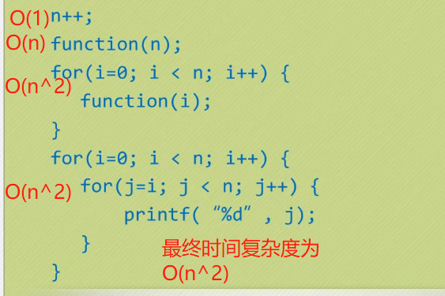
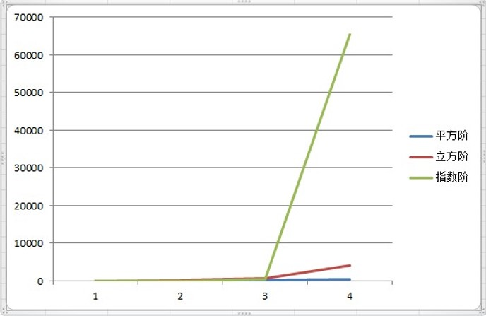

#  时间复杂度和空间复杂度3
## 算法的空间复杂度
### 函数调用的时间复杂度分析

`def function(count):
     print("{}".format(count))
 n = 100
 for i in range(n+0):
     function(i)
     `
function函数的时间复杂度是O(1)，所以整体的时间复杂度就是循环的次数O(n)。

`def function(count):
     print("{}".format(count))
 n = 100
 for i in range(n+0):
     function(i)
     `
这和之前我们讲解平方阶的时候举的第二个例子一样：function内部的循环次数随count的增加(接近n)而减少，所以根据游戏攻略算法的时间复杂度为O(n^2)。
`n = n + 1
 function2(n)
 for i in range(n+0):
     function2(i)
 for i in range(n+0):
     for j in range(n+0-i):
         print(j)
         `

### 常见的时间复杂度

* 常用的时间复杂度所耗费的时间从小到大依次是：
O(1) < O(logn) < (n) < O(nlogn) < O(n^2) < O(n^3) < O(2^n) < O(n!) < O(n^n)

### 最坏情况与平均情况
* 查找一个有n个随机数字数组中的某个数字，最好的情况是第一个数字就是，那么算法的时间复杂度为O(1)，但也有可能这个数字就在最后一个位置，那么时间复杂度为O(n)。
* 平均运行时间是期望的运行时间。
* 最坏运行时间是一种保证。在应用中，这是一种最重要的需求，通常除非特别指定，我们提到的运行时间都是最坏情况的运行时间。
## 算法的空间复杂度
在写代码时，完全可以用空间来换去时间。
### 举个例子
要判断某年是不是闰年
* 方法一：
    * 写一个算法，每给一个年份，就可以通过这个算法计算得到是否闰年的结果。
* 方法二：
    * 事先建立一个有2050个元素的数组，然后把所有的年份按下标的数字对应，如果是闰年，则此数组元素的值是1，如果不是元素的值则为0。这样，所谓的判断某一年是否为闰年就变成了查找这个数组某一个元素的值的问题。

方法一相比起方法二来说很明显非常节省空间，但每一次查询都需要经过一系列的计算才能知道是否为闰年。第二种方法虽然需要在内存里存储2050个元素的数组，但是每次查询只需要一次索引判断即可。

算法的空间复杂度通过计算算法所需的存储空间实现，算法的空间复杂度的计算公式记作：S(n)=O(f(n))，其中，n为问题的规模，f(n)为语句关于n所占存储空间的函数。
