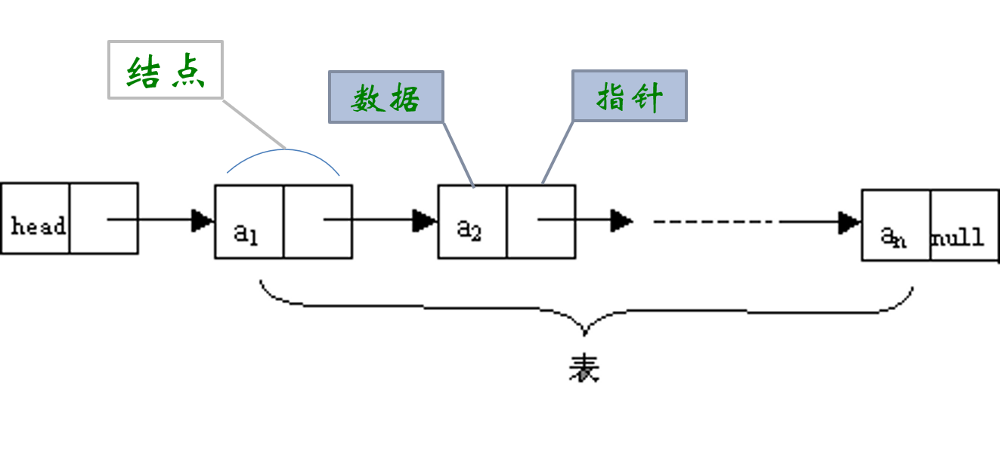
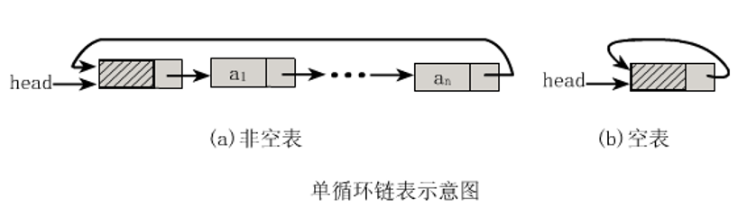
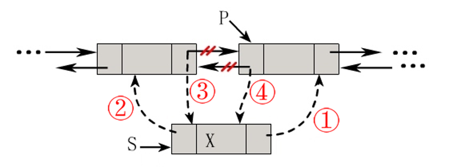
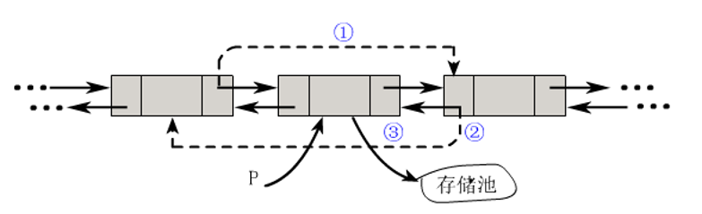
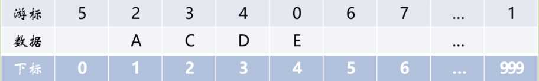
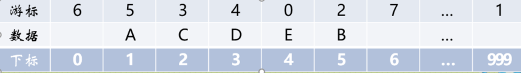
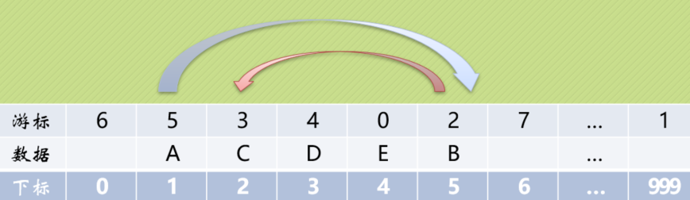
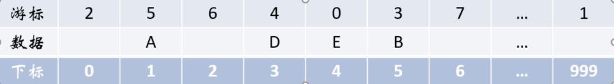

# 线性表

[TOC]


## 线性表的定义 

- 线性表（List）：
  
  - 由**零个或多个**数据元素组成的**有限序列**。
- 注意：
  - 首先它是一个序列，也就是说元素之间是有个先来后到的顺序。
  
  - 若元素存在多个，则第一个元素无前驱，而最后一个元素无后继，其他元素都有且只有一个前驱和后继。
  
    
    将线性表记为(a_1,…,a_{i-1},a_i,a_{i+1},…a_n),则表中a_{i-1}领先于a_i,a_i领先于a_{i+1},称a_{i-1}是a_i的直接前驱元素,a_{i+1}是a_i的直接后继元素。
  
  - 另外，线性表强调是有限的，事实上无论计算机发展到多强大，它所处理的元素都是有限的。
  
  - 线性表元素的个数n(n>=0)定义为线性表的长度，当n=0时，称为空表。

## 抽象数据类型

### 数据类型

一组性质相同的值的集合及定义在此集合上的一些操作的总称。

例如很多编程语言的整型，浮点型，字符型这些指的就是数据类型。

- 在C语言中，按照取值的不同，数据类型可以分为两类：
  - 原子类型：不可以再分解的基本类型，例如整型、浮点型、字符型等。
  - 结构类型：由若干个类型组合而成，是可以再分解的，例如整型数组是由若干整型数据组成的。

### 抽象

指抽取出事物具有的普遍性的本质。它要求抽出问题的特征而忽略非本质的细节，是对具体事物的一个概括。抽象是一种思考问题的方式，它隐藏了繁杂的细节。对已有的数据类型进行抽象，就有了抽象数据类型。

### 抽象数据类型

- 抽象数据类型（Abstract Data Type，ADT）是指一个数据类型及定义在该数据类型上的一组操作。即把数据类型和数据类型上的运算捆在一起，进行封装。抽象数据类型的定义仅取决于它的一组逻辑特性，而与其在计算机内部如何表示和实现无关。“抽象”的意义在于数据类型的数学抽象特性。而且，抽象数据类型不仅仅指那些已经定义并实现的数据类型，还可以是计算机编程者在设计软件程序时自己定义的数据类型。引入抽象数据类型的目的是把数据类型的表示和数据类型上运算的实现与这些数据类型和运算在程序中的引用隔开，使它们相互独立。
- 例如一个3D游戏中，要定位角色的位置，那么总会出现x,y,z三个整型数据组合在一起的坐标。我们就可以定义一个point的抽象数据类型，它拥有x,y,z三个整型变量，这样我们就可以方便的对一个角色的位置进行操作。

### 线性表的抽象数据类型定义

所谓抽象数据类型就是把数据类型和相关操作捆绑在一起。

* ADT 线性表（List）
    * 由零个或多个数据元素组成的有限序列。
* Data
    * 线性表的数据对象集合为\{a_1,a_2,…,a_n\}，每个元素的类型均为DataType。其中，除第一个元素a_1外，每一个元素有且只有一个直接前驱元素，除了最后一个元素a_n外，每一个元素有且只有一个直接后继元素。数据元素之间的关系是一对一的关系。

* 常见操作
  * 插入
  * 删除
  * 修改
  * 查找
  * 排序

## 顺序表

线性表有两种物理存储结构：顺序存储结构和链式存储结构。

* 顺序存储结构（顺序表）

  * 用一段地址连续的存储单元**依次**存储线性表的数据元素
  * 
  * 物理上的存储方式事实上就是在内存中找个初始地址，然后通过占位的形式，把一定的内存空间给占了，然后把相同数据类型的数据元素依次放在这块空地中。

  

* 顺序表封装需要三个属性：

  * 存储空间的起始位置，数组elem，它的存储位置就是线性表存储空间的存储位置。
  * 线性表的最大存储容量：长度MaxSize。
  * 线性表的当前长度：length。

* 注意：数组的长度与线性表的当前长度需要区分一下：数组的长度是存放线性表的存储空间的总长度，一般初始化后不变。而线性表的当前长度是线性表中元素的个数，是会变化的。

### 顺序表的两种基本实现方式


图a为一体式结构，存储表信息的单元与元素存储区以连续的方式安排在一块存储区里，两部分数据的整体形成一个完整的顺序表对象。一体式结构整体性强，易于管理。但是由于数据元素存储区域是表对象的一部分，顺序表创建后，元素存储区就固定了。

图b为分离式结构，表对象里只保存与整个表有关的信息（即容量和元素个数），实际数据元素存放在另一个独立的元素存储区里，通过链接与基本表对象关联。

### 顺序表的地址计算方法

* 顺序表的定义充分考虑到很多军师级别领导的智商指数，所以决定从1开始回归正常思维。
* 假设数据元素类型占用的是c个存储单元（字节），那么线性表中第i+1个数据元素和第i个数据元素的存储位置的关系是（loc表示获得存储位置的函数）：loc(a_i+1)= loc(a_i) + c
* 对于每个所占的存储单元大小固定相同的元素，第i个数据元素a_i的存储位置可以由a_1推算得出：loc(a_i) = loc(a_1) + (i-1)*c，如图a所示：
* 如果元素的大小不统一，则须采用图b的元素外置的形式，将实际数据元素另行存储，而顺序表中各单元位置保存对应元素的地址信息（即链接）。**注意，图b中的c不再是数据元素的大小，而是存储一个链接地址所需的存储量，这个量通常很小。**
* 线性表地址计算

### 顺序表的操作

#### 获得元素操作

* 实现`获得元素操作`的具体操作，即将线性表L中的第i个位置元素值返回。

  


#### 增加元素

* 顺序表具有随机存储结构的特点，时间复杂度为O(1)。

* 如图所示，为顺序表增加新元素111的三种方式:

  * 尾端加入元素，时间复杂度为O(1)

  * 非保序的加入元素（不常见），时间复杂度为O(1)
  * 保序的元素加入，时间复杂度为O(n)
  
    

#### 删除操作

* 删除算法的思路：
  - 删除表尾元素，时间复杂度为O(1)
  - 非保序的元素删除（不常见），时间复杂度为O(1)
  - 保序的元素删除，时间复杂度为O(n)
  
  

#### 插入和删除的时间复杂度

- 最好的情况：插入和删除操作刚好要求在最后一个位置操作，因为不需要移动任何元素，所以此时的时间复杂度为O(1)。
- 最坏的情况：如果要插入和删除的位置是第一个元素，那就意味着要移动所有的元素向后或者向前，所以这个时间复杂度为O(n)。
- 至于平均情况，就取中间值O((n-1)/2)。按照前边游戏秘籍指导，平均情况复杂度简化后还是O(n)。

### 顺序表的优缺点

* 顺序表在存、读数据时，不管是哪个位置，时间复杂度都是O(1)。
* 在插入或删除时，时间复杂度都是O(n)。
* 优点：
  * 无须为表示表中元素之间的逻辑关系而增加额外的存储空间。
  * 可以快速地存取表中任意位置的元素。
* 缺点：
  * 插入和删除操作需要移动大量元素。
  * 当线性表长度变化较大时，难以确定存储空间的容量。
  * 容易造成存储空间的“碎片”。

### Python中的顺序表

Python中的list和tuple两种类型采用了顺序表的实现技术，具有前面讨论的顺序表的所有性质。tuple是不可变类型，即不变的顺序表，因此不支持改变其内部状态的任何操作，而其他方面，则与list的性质类似。

#### list的基本实现技术

Python标准类型list就是一种元素个数可变的线性表，可以加入和删除元素，并在各种操作中维持已有元素的顺序（即保序），而且还具有以下行为特征：

* 基于下标（位置）的高效元素访问和更新，时间复杂度应该是O(1)；为满足该特征，应该采用顺序表技术，表中元素保存在一块连续的存储区中。

* 允许任意加入元素，而且在不断加入元素的过程中，表对象的标识（函数id得到的值）不变。为满足该特征，就必须能更换元素存储区，并且为保证更换存储区时list对象的标识id不变，只能采用分离式实现技术。

在Python的官方实现中，list就是一种采用分离式技术实现的动态顺序表。这就是为什么用`list.append(x)` （或 `list.insert(len(list), x)`，即尾部插入）比在指定位置插入元素效率高的原因。

在Python的官方实现中，list实现采用了如下的策略：在建立空表（或者很小的表）时，系统分配一块能容纳8个元素的存储区；在执行插入操作（`insert`或`append`）时，如果元素存储区满就换一块4倍大的存储区。但如果此时的表已经很大（目前的阀值为50000），则改变策略，采用加一倍的方法。引入这种改变策略的方式，是为了避免出现过多空闲的存储位置。

## 链表

* 链表的特点:
  * 用一组任意的存储单元存储线性表的数据元素，这组存储单元可以存在内存中未被占用的任意位置。链表结构充分利用了计算机内存空间，实现灵活的内存动态管理。

* 顺序存储结构每个数据元素只需要存储一个位置就可以了。现在链式存储结构中，除了要存储数据元素信息外，还要存储它的后继元素的存储地址（指针）。

* 存储数据元素信息的域称为数据域，把存储直接后继位置的域称为指针域。指针域中存储的信息称为指针或链。这两部分信息组成数据元素称为存储映像，称为结点(Node)。

* n个结点链接成一个链表，即为线性表(a_1,a_2, a_3, …, a_n)的链式存储结构。

* 因为此链表的每个结点中只包含一个指针域，所以叫做单链表。
* 单链表结构图
  * 线性表来说，总得有个头有个尾，链表也不例外。我们把链表中的第一个结点的存储位置叫做头指针，最后一个结点指针为空(NULL)。



### 头指针与头结点的异同

头结点的数据域不存储任何信息

* 头指针
  * 头指针是指链表指向第一个结点的指针，若链表有头结点，则是指向头结点的指针。
  * 头指针具有标识作用，所以常用头指针冠以链表的名字（指针变量的名字）。
  * 无论链表是否为空，头指针均不为空。
  * 头指针是链表的必要元素。

* 头结点
  * 头结点是为了操作的统一和方便而设立的，放在第一个元素的结点之前，其数据域一般无意义（但也可以用来存放链表的长度）。
* 有了头结点，对在第一元素结点前插入结点和删除第一结点起操作与其它结点的操作就统一了。
  * 头结点不一定是链表的必须要素。


### 单链表

#### 单链表存储结构

单链表也叫单向链表，是链表中最简单的一种形式，它的每个节点包含两个域，一个信息域（数据域）和一个链接(指针)域。这个链接指向链表中的下一个节点，而最后一个节点的链接(指针)域则指向一个空值。

* 单链表

  

* 空链表

  

* 节点由存放数据元素的数据域和存放后继结点地址的指针域组成。

##### 节点实现

```python
class Node(object):
    """
    链表的节点
    """

    def __init__(self, elem):
        self.elem = elem
        self.next = None
```


#### 单链表的操作

##### 链表是否为空

* 代码实现：

  ```python
  class SingleLinkList(object):
      """
      单链表
      """
  
      def __init__(self, node=None):
          self.__head = node
      
      def is_empty(self):
          """
          判断链表是否为空
          :return:True/False
          """
          # 是否指向None
          return self.__head is None
  ```

  

##### 链表长度

- 代码实现：

  ```python
      def length(self):
          """
          链表的长度
          :return:链表的长度
          """
          # cur游标，用来移动遍历节点
          cur = self.__head
          # count记录数量
          count = 0
          while cur is not None:
              count += 1
              cur = cur.next
  
          return count
  ```

  

##### 遍历整个链表

- 代码实现：

  ```python
      def travel(self):
          """
          遍历链表
          :return:
          """
          # cur游标，用来移动遍历节点
          cur = self.__head
          while cur is not None:
              print(cur.elem, end=" ")
              cur = cur.next
          print("\n")
  ```

  

##### 链表头部添加元素

- 代码实现：

  ```python
      def add(self, item):
          """头部添加元素"""
          # 先创建一个保存item值的节点
          node = Node(item)
          # 将新节点的链接域next指向头节点，即__head指向的位置
          node.next = self.__head
          # 将链表的头__head指向新节点
          self.__head = node
  ```

  

##### 链表尾部添加元素

- 代码实现：

  ```python
      def append(self, item):
          """
          链表的尾部添加元素，尾插法
          :param item: 要添加的元素
          :return:
          """
          # 先创建一个保存item值的节点
          node = SingleNode(item)
          # 先判断链表是否为空，若是空链表，则将__head指向新节点
          if self.is_empty():
              self.__head = node
          # 若不为空，则找到尾部，将尾节点的next指向新节点
          else:
              cur = self.__head
              while cur.next != None:
                  cur = cur.next
              cur.next = node
  ```

  

##### 指定位置添加元素

- 代码实现：

  ```python
      def insert(self, pos, item):
          """
          指定位置添加元素
          :param pos:指定的位置
          :param item:要添加的元素
          :return:
          """
          # 若指定位置pos为第一个元素之前，则执行头部插入
          if pos <= 0:
              self.add(item)
          # 若指定位置超过链表尾部，则执行尾部插入
          elif pos > (self.length()-1):
              self.append(item)
          # 找到指定位置
          else:
              node = SingleNode(item)
              count = 0
              # pre用来指向指定位置pos的前一个位置pos-1，初始从头节点开始移动到指定位置
              pre = self.__head
              while count < (pos-1):
                  count += 1
                  pre = pre.next
              # 先将新节点node的next指向插入位置的节点
              node.next = pre.next
              # 将插入位置的前一个节点的next指向新节点
              pre.next = node
  ```

  

#####  删除节点

- 代码实现：

  ```python
      def remove(self,item):
          """
          删除节点
          :param item:要删除的元素
          :return:
          """
          # 定义两个游标cur,pre,pre永远在cur后一个位置
          cur = self.__head
          pre = None
          while cur != None:
              # 找到了指定元素
              if cur.item == item:
                  # 如果第一个就是删除的节点
                  if not pre:
                      # 将头指针指向头节点的后一个节点
                      self.__headd = cur.next
                  else:
                      # 将删除位置前一个节点的next指向删除位置的后一个节点
                      pre.next = cur.next
                  break
              else:
                  # 继续按链表后移节点
                  pre = cur
                  cur = cur.next
  ```

  

##### 查找节点是否存在

- 代码实现：

  ```python
      def search(self,item):
          """
          查找节点是否存在
          :param item:查找的节点值
          :return:True/False
          """
          cur = self.__head
          while cur != None:
              if cur.item == item:
                  return True
              cur = cur.next
          return False
  ```

##### 测试

​		

```python
if __name__ == '__main__':

    # 实例化链表
    ll = SingleLinkList()

    # 判断链表是否为空
    print(ll.is_empty())

    # 链表的长度
    print(ll.length())

    # 在链表的尾部添加节点 1
    ll.append(1)
    ll.travel()

    # 在链表的头添加节点 0
    ll.add(0)
    ll.travel()

    # 链表添加节点
    ll.append(2)
    ll.append(3)
    ll.append(4)
    ll.append(5)
    ll.append(6)
    ll.travel()
    print(ll.length())

    # 插入的位置为-1 因此使用头插法
    ll.insert(-1, 999)  # 999 0 1 2 3 4 5 6
    ll.travel()

    # 在位置2插入100
    ll.insert(2, 100)  # 999 0 1 100 2 3 4 5 6
    ll.travel()

    # 插入的位置为10 因此使用尾插法
    ll.insert(10, 200)  # 999 0 1 100 2 3 4 5 6 200
    ll.travel()

    # 移除第一个200的元素
    ll.remove(200)
    ll.travel()

    # 移除第一个999的元素
    ll.remove(999)
    ll.travel()
```


#### 单链表与顺序表优缺点

我们分别从存储分配方式、时间性能、空间性能三方面来做对比。

* 存储分配方式：
  * 顺序存储结构用一段连续的存储单元依次存储线性表的数据元素。
  * 单链表采用链式存储结构，用一组任意的存储单元存放线性表的元素。
* 时间性能：
  * 查找
    * 顺序存储结构O(1)
    * 单链表O(n)
  * 插入和删除
    * 顺序存储结构需要平均移动表长一半的元素，时间为O(n)
    * 单链表在计算出某位置的指针后，插入和删除时间仅为O(1)
* 空间性能：
  * 顺序存储结构需要预分配存储空间，分大了，容易造成空间浪费，分小了，容易发生溢出。
  * 单链表不需要分配存储空间，只要有就可以分配，元素个数也不受限制。
* 结论：
  * 若线性表需要频繁查找，很少进行插入和删除操作时，宜采用顺序存储结构。
  * 若需要频繁插入和删除时，宜采用单链表结构。

其实也就是在内存中将它释放掉，以便于留出空间给其他程序或软件使用。


### 循环链表

单链表存在的问题：

- 由于每个结点只存储了向后的指针，到了尾部标识就停止了向后链的操作。也就是说，按照这样的方式，只能索引后继结点不能索引前驱结点。也就是说，不从头结点出发，就无法访问到全部结点。

解决办法：

- 将单链表中终端结点的指针端由空指针改为指向头结点，就使整个单链表形成一个环，这种头尾相接的单链表成为单循环链表，简称循环链表。

#### 单循环链表结构示意图



- 注意：
  - **循环链表不一定要有头结点**。
  - 循环链表的单链表的主要差异就在于循环的判断空链表的条件上，原来判断头指针是否为null，现在则是判断头指针是否等于head。
  - 终端结点用尾指针rear指示，则查找终端结点是O(1)，而开始结点是rear->next->next，当然也是O(1)。

##### 节点实现

```python
class Node(object):
    """节点"""
    def __init__(self, item):
        self.item = item
        self.next = None
```


#### 单循环链表操作

##### 判断链表是否为空

* 代码实现

  ```python
  class SinCycLinkedlist(object):
      """
      单向循环链表
      """
      def __init__(self):
          self._head = None
  
      def is_empty(self):
          """
          判断链表是否为空
          :return: True/False
          """
          return self._head == None
  ```

  

##### 返回链表的长度

- 代码实现

  ```python
      def length(self):
          """
          返回链表的长度
          :return: 链表的长度
          """
          # 如果链表为空，返回长度0
          if self.is_empty():
              return 0
          count = 1
          cur = self._head
          while cur.next != self._head:
              count += 1
              cur = cur.next
          return count
  ```

  

##### 遍历

- 代码实现

  ```python
      def travel(self):
          """
          遍历链表
          :return:
          """
          if self.is_empty():
              return
          cur = self._head
          print(cur.item)
          while cur.next != self._head:
              cur = cur.next
              print(cur.item,end =" ")
          print("")
  
  ```

  

##### 在头部添加一个节点

- 代码实现

  ```python
      def add(self, item):
          """
          头部添加节点
          :param item: 添加的元素
          :return:
          """
          node = Node(item)
          if self.is_empty():
              self._head = node
              node.next = self._head
          else:
              #添加的节点指向_head
              node.next = self._head
              # 移到链表尾部，将尾部节点的next指向node
              cur = self._head
              while cur.next != self._head:
                  cur = cur.next
              cur.next = node
              #_head指向添加node的
              self._head = node
  ```

  

##### 在尾部添加一个节点

- 代码实现

  ```python
      def append(self, item):
          """
          尾部添加节点
          :param item: 添加的元素
          :return:
          """
          node = Node(item)
          if self.is_empty():
              self._head = node
              node.next = self._head
          else:
              # 移到链表尾部
              cur = self._head
              while cur.next != self._head:
                  cur = cur.next
              # 将尾节点指向node
              cur.next = node
              # 将node指向头节点_head
              node.next = self._head
  ```

  

##### 在指定位置pos添加节点

- 代码实现

  ```python
      def insert(self, pos, item):
          """
          在指定位置添加节点
          :param pos: 指定位置
          :param item: 添加的元素
          :return:
          """
          if pos <= 0:
              self.add(item)
          elif pos > (self.length()-1):
              self.append(item)
          else:
              node = Node(item)
              cur = self._head
              count = 0
              # 移动到指定位置的前一个位置
              while count < (pos-1):
                  count += 1
                  cur = cur.next
              node.next = cur.next
              cur.next = node
  ```

  

##### 删除一个节点

- 代码实现

  ```python
      def remove(self, item):
          """
          删除一个节点
          :param item: 删除的节点
          :return:
          """
          # 若链表为空，则直接返回
          if self.is_empty():
              return
          # 将cur指向头节点
          cur = self._head
          pre = None
          # 若头节点的元素就是要查找的元素item
          if cur.item == item:
              # 如果链表不止一个节点
              if cur.next != self._head:
                  # 先找到尾节点，将尾节点的next指向第二个节点
                  while cur.next != self._head:
                      cur = cur.next
                  # cur指向了尾节点
                  cur.next = self._head.next
                  self._head = self._head.next
              else:
                  # 链表只有一个节点
                  self._head = None
          else:
              pre = self._head
              # 第一个节点不是要删除的
              while cur.next != self._head:
                  # 找到了要删除的元素
                  if cur.item == item:
                      # 删除
                      pre.next = cur.next
                      return
                  else:
                      pre = cur
                      cur = cur.next
              # cur 指向尾节点
              if cur.item == item:
                  # 尾部删除
                  pre.next = cur.next
  ```

  

##### 查找节点是否存在

- 代码实现

  ```python
      def search(self, item):
          """
          查找节点是否存在
          :param item: 查找的元素
          :return:
          """
          if self.is_empty():
              return False
          cur = self._head
          if cur.item == item:
              return True
          while cur.next != self._head:
              cur = cur.next
              if cur.item == item:
                  return True
          return False
  ```

  

##### 测试

```python
if __name__ == "__main__":
    # 实例化单循环链表
    ll = SinCycLinkedlist()

    # 头部添加节点
    ll.add(1) # 起始节点为1
    ll.travel()
    print("*" * 20)

    # 尾部添加节点
    ll.append(3)
    ll.travel() # 3
    print("*" * 20)

    # 插入节点
    ll.insert(2, 4)
    ll.insert(4, 5)
    ll.insert(2, 11)
    ll.travel() # 3 11 4 5 
    print("*" * 20)

    # 链表长度
    print("length:",ll.length()) # length: 5
    print("*" * 20)
    # 查找节点
    print(ll.search(3)) # True
    print(ll.search(7)) # False
    print("*" * 20)
    # 移除节点
    ll.remove(1)
    ll.travel() # 11 4 5
    print("length:",ll.length()) # length: 4

```

##### 约瑟夫问题

###### 背景

据说著名犹太历史学家 Josephus有过以下的故事：在罗马人占领乔塔帕特后，39个犹太人与Josephus及他的朋友躲到一个洞中，39个犹太人决定宁愿死也不要被敌人抓到，于是决定了一个自杀方式，41个人排成一个圆圈，由第1个人开始报数，每报数到第3人该人就必须自杀，然后再由下一个重新报数，直到所有人都自杀身亡为止。

然而Josephus和他的朋友并不想遵从，Josephus要他的朋友先假装遵从，他将朋友与自己安排在第16个与第31个位置，于是逃过了这场死亡游戏。

###### 问题

- 用循环链表模拟约瑟夫问题，把41个人自杀的顺序编号输出。

- 代码实现

  ```python
  class Node(object):
      """结点"""
      def __init__(self,item):
          self.elem = item
          self.next = None
  
  class SingleCycleLinkList(object):
      """单向循环链表"""
      def __init__(self):
          self.head = None
  
      def append(self,item):
          node = Node(item)
          if self.head is None:
              self.head = node
              node.next = node
          else:
              cur = self.head
              while cur.next != self.head:
                  cur = cur.next
              cur.next = node
              node.next = self.head
  
      def travel(self):
          cur = self.head
          while cur.next != self.head:
              print(cur.elem, end=" ")
              cur = cur.next
          print(cur.elem)
  
      def remove(self,item):
          '''删除节点'''
          cur = self.head
          pre = None
          while cur.next != self.head:
              if cur.elem == item:
                  #头节点的情况
                  if cur == self.head:
                      rear = self.head
                      while rear.next != self.head:
                          rear = rear.next
                      rear.next = cur.next
                      self.head = cur.next
                  else:
                      #中间结点的情况
                      pre.next = cur.next
                  return
              else:
                  pre = cur
                  cur = cur.next
      #尾节点的情况和一个元素的情况
          if cur.elem == item:
                  # 一个元素的情况
              if cur == self.head:
                  self.head = None
                  # 尾节点元素的情况
              else:
                  pre.next = self.head
                  # pre.next = cur.next
  
      def judgement(self):
          cur = self.head
          count = 1
          while cur != cur.next :
              cur = cur.next
              count += 1
              if count == 3:
                  self.remove(cur.elem)
                  print("Kill:",cur.elem)
                  print("survive:",end =" ")
                  self.travel()
                  print("----"*20)
                  # print("%d-->"%cur.elem,end="")
                  count = 0
          # print(cur.elem)
  
  if __name__ == '__main__':
      sll = SingleCycleLinkList()
      for i in range(1,42):
          sll.append(i)
      sll.judgement()
  ```

  

### 双向链表

一种更复杂的链表是“双向链表”或“双面链表”。每个节点有两个链接：一个指向前一个节点，当此节点为第一个节点时，指向空值；而另一个指向下一个节点，当此节点为最后一个节点时，指向空值。

#### 双向链表的存储结构


##### 节点实现

```python
class Node(object):
    """
    双向链表节点
    """

    def __init__(self, item):
        self.item = item
        self.next = None
        self.prev = None
```


#### 双向链表操作

##### 链表是否为空

* 代码实现：

  ```python
  class DLinkList(object):
      """
      双向链表
      """
  
      def __init__(self):
          self.__head = None
  
      def is_empty(self):
          """
          判断链表是否为空
          :return:
          """
          return self.__head is None
  ```

  

##### 链表长度

* 代码实现：

  ```python
      def length(self):
          """
          返回链表的长度
          :return:
          """
          cur = self.__head
          count = 0
          while cur is not None:
              count += 1
              cur = cur.next
          return count
  ```

  

##### 遍历链表

* 代码实现：

  ```python
      def travel(self):
          """
          遍历链表
          :return:
          """
          cur = self.__head
          while cur is not None:
              print(cur.item, end=" ")
              cur = cur.next
          print("")
  ```

  

##### 链表头部添加

* 代码实现：

  ```python
      def add(self, item):
          """
          头部插入元素
          :param item:
          :return:
          """
          node = Node(item)
          if self.is_empty():
              # 如果是空链表，将__head指向node
              self.__head = node
          else:
              # 将node的next指向__head的头节点
              node.next = self.__head
              # 将__head的头节点的prev指向node
              self.__head.prev = node
              # 将__head 指向node
              self.__head = node
  ```

  

##### 链表尾部添加

* 代码实现：

  ```python
      def append(self, item):
          """
          尾部插入元素
          :param item: 要插入的元素
          :return:
          """
          node = Node(item)
          if self.is_empty():
              # 如果是空链表，将__head指向node
              self.__head = node
          else:
              # 移动到链表尾部
              cur = self.__head
              while cur.next is not None:
                  cur = cur.next
              # 将尾节点cur的next指向node
              cur.next = node
              # 将node的prev指向cur
              node.prev = cur
  
  ```

  

##### 指定位置添加

* 代码思路



* 代码实现：

  ```python
      def insert(self, pos, item):
          """
          在指定位置添加节点
          :param pos: 指定的位置
          :param item: 要添加的元素
          :return:
          """
          if pos <= 0:
              self.add(item)
          elif pos > (self.length() - 1):
              self.append(item)
          else:
              node = Node(item)
              cur = self.__head
              count = 0
              # 移动到指定位置的前一个位置
              while count < (pos - 1):
                  count += 1
                  cur = cur.next
              # 将node的prev指向cur
              node.prev = cur
              # 将node的next指向cur的下一个节点
              node.next = cur.next
              # 将cur的下一个节点的prev指向node
              cur.next.prev = node
              # 将cur的next指向node
              cur.next = node
  ```

  

##### 删除节点

* 代码思路

  

* 代码实现：

  ```python
      def remove(self, item):
          """
          删除元素
          :param item: 要删除的节点
          :return:
          """
          if self.is_empty():
              return
          else:
              cur = self.__head
              if cur.item == item:
                  # 如果首节点的元素即是要删除的元素
                  if cur.next is None:
                      # 如果链表只有这一个节点
                      self.__head = None
                  else:
                      # 将第二个节点的prev设置为None
                      cur.next.prev = None
                      # 将__head指向第二个节点
                      self.__head = cur.next
                  return
              while cur is not None:
                  if cur.item == item:
                      # 将cur的前一个节点的next指向cur的后一个节点
                      cur.prev.next = cur.next
                      # 将cur的后一个节点的prev指向cur的前一个节点
                      cur.next.prev = cur.prev
                      break
                  cur = cur.next
  ```

  

##### 查找节点是否存在

* 代码实现：

  ```python
      def search(self, item):
          """
          查找元素是否存在
          :param item: 要查找的元素
          :return: True/False
          """
          cur = self.__head
          while cur is not None:
              if cur.item == item:
                  return True
              cur = cur.next
          return False
  ```

  

##### 测试

```python
if __name__ == "__main__":
    # 实例化链表
    ll = DLinkList()

    # 头部增加节点
    ll.add(1)
    ll.add(2)

    # 尾部增加节点
    ll.append(3)

    # 插入4 ，5， 6
    ll.insert(2, 4)
    ll.insert(4, 5)
    ll.insert(0, 6)

    print("length:", ll.length()) # 6

    ll.travel() # 6 2 1 4 3 5

    print(ll.search(3)) # True
    print(ll.search(4)) # True

    # 移除节点
    ll.remove(1)

    ll.travel() # 6 2 4 3 5
    print("length:", ll.length())# 5
```


### 静态链表(理解)

用数组描述的链表叫做静态链表，这种描述方法叫做游标实现法。（因为数组在声明的时候，就必须声明其占用多大的空间，不像动态链表，需要一个就动态的申请一个，不需要就动态释放掉）



将数组元素分成两个数据域，data和cur(游标)。data用来存放数据元素，cur(游标)存放该元素的后继在数组中的下标(游标)。

注意：

* 两对特殊的元素，一对是下标为0的元素，它不存放数据，另一对是下标为MaxSize-1的(即最后一个元素)元素，同样不存放数据，即头和尾数据都是空的；
* 单最后一个元素的游标存放的是第一个存放了数据的元素的下标地址，即1；
* 第一个元素的游标存放的是第一个未存放数据的元素的下标地址，即5；
* 每一个存放了数据的元素的游标则是指向该元素下一个元素的下标地址，如存放了A的游标指向的是A的下一个元素C的下标地址。


#### 静态链表的操作

##### 链表的初始化（即初始化数组）

重点：

* 我们对数组的第一个和最后一个元素做特殊处理，它们的data不存放数据；

* 我们通常把未使用的数组元素称为备用链表；

* 数组的第一个元素，即下标为0的那个元素的cur就存放备用链表的第一个结点的下标；

* 数组的最后一个元素，即下标为MAXSIZE-1的cur则存放第一个有数值的元素的下标，相当于单链表中的头结点作用；

* 数组中最后一个存放了数据的元素的游标指向第一个元素的下标地址，即0。


##### 链表的插入

为了判断出数组中哪些分量未被使用，解决的办法就是将所有未被使用过的和之前已被删除的分量用游标链成一个备用的链表。每当进行插入操作时，就可以从备用链表上取得第一个结点作为待插入的新结点，比如，如下图中，我们需要将新结点B插入到A的后面：






因为我们之前已经知道了，每个元素的游标的值即是指向该元素下一个元素的下标地址，而B要插入到A之后，所以A的游标值就必须指向B的下标地址（即A的游标值由原来的2变为现在的5）,那么B的游标值就要指向C的下标地址，或者说指向原来A的游标(即B的游标值由原来的6变为现在的2)。

##### 链表的删除操作




- 首先，C被删除了，那么B的游标就应该指向D的下标（即2-->3）

*  然后，C这个位置就归为了空闲链表中的第一个元素，那么C之前所在位置的游标就应该指向下一个空闲分量的下标（即3-->6）

* 最后A的游标应该指向第一个空闲分量的下标，即改为C之前所在位置的下标（即6-->2）

#### 静态链表优缺点总结

- 优点：
  - 在插入和删除操作时，只需要修改游标，不需要移动元素，从而改进了在顺序存储结构中的插入和删除操作需要移动大量元素的缺点。
- 缺点：
  - 没有解决连续存储分配（数组）带来的表长难以确定的问题。
  - 失去了顺序存储结构随机存取的特性。
## 参考资料

[小甲鱼数据结构与算法](https://www.bilibili.com/video/av2975983/?p=18)

[python-data-structure-and-algorithm](https://github.com/jamesyangget/python-data-structure-and-algorithm)


