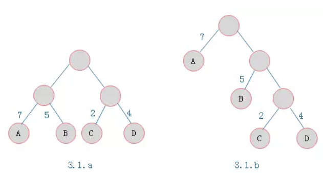
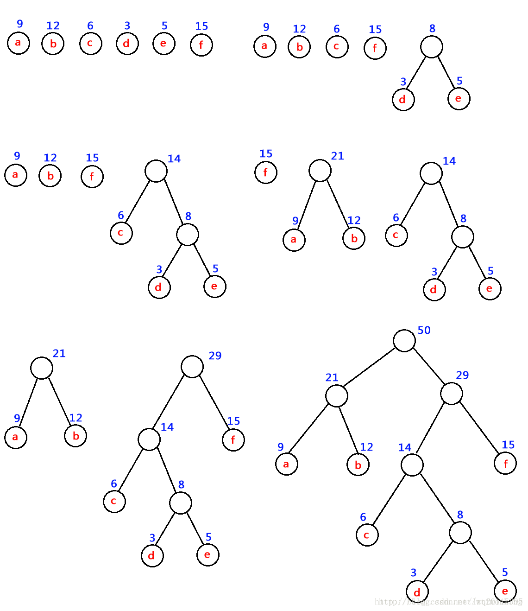
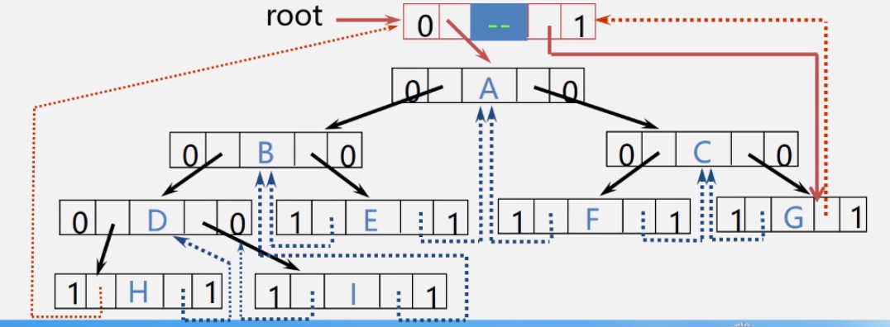

### 霍夫曼树

**霍夫曼树**：给定n个权值作为n个叶子节点，构造一棵二叉树，若带权路径长度达到最小，称这样的二叉树为最优二叉树，也称为霍夫曼树(Huffman Tree)。



叶子节点为A、B、C、D，对应权值分别为7、5、2、4。
3.1.a树的WPL = 7 * 2 + 5 * 2 + 2 * 2 + 4 * 2 = 36
3.1.b树的WPL = 7 * 1 + 5 * 2 + 2 * 3 + 4 * 3 = 35
由ABCD构成叶子节点的二叉树形态有许多种，但是WPL最小的树只有3.1.b所示的形态。则3.1.b树为一棵霍夫曼树。

**特点：**

* 满二叉树不一定是霍夫曼树。
* 霍夫曼树中权越大的叶子离根越近。
* 具有相同带权节点的霍夫曼树不惟一

#### **构造霍夫曼树**

* 假设有n个权值，则构造出的霍夫曼树有n个叶子节点。 n个权值分别设为 w1、w2、…、wn，则霍夫曼树的构造规则为：

  * 将w1、w2、…，wn看成是有n 棵树的森林(每棵树仅有一个节点)；
  * 在森林中选出两个根节点的权值最小的树合并，作为一棵新树的左、右子树，且新树的根节点权值为其左、右子树根节点权值之和；
  * 从森林中删除选取的两棵树，并将新树加入森林；
  * 重复(2)、(3)步，直到森林中只剩一棵树为止，该树即为所求得的霍夫曼树。

  口诀：

  霍夫曼算法口诀：①构造森林全是根；②选用两小造新树；③删除两小添新人；④重复2、3剩单根。

* 举个例子

  对下图中的六个带权叶子节点来构造一棵霍夫曼树

  


#### **霍夫曼编码**

* 等长编码

  这种编码方式的特点是每个字符的编码长度相同（编码长度就是每个编码所含的二进制位数）。假设字符集只含有4个字符A，B，C，D，用二进制两位表示的编码分别为00，01，10，11。若现在有一段电文为：ABACCDA，则应发送二进制序列：00010010101100，总长度为14位。当接收方接收到这段电文后，将按两位一段进行译码。这种编码的特点是译码简单且具有唯一性，但编码长度并不是最短的。

* 不等长编码

  在传送电文时，为了使其二进制位数尽可能地少，可以将每个字符的编码设计为不等长的，使用频度较高的字符分配一个相对比较短的编码，使用频度较低的字符分配一个比较长的编码。例如，可以为A，B，C，D四个字符分别分配0，00，1，01，并可将上述电文用二进制序列：000011010发送，其长度只有9个二进制位，但随之带来了一个问题，接收方接到这段电文后无法进行译码，因为无法断定前面4个0是4个A，1个B、2个A，还是2个B，即译码不唯一，因此这种编码方法不可使用。

因此，为了设计长短不等的编码，以便减少电文的总长，还必须考虑编码的**唯一性**，即在建立不等长编码时必须使任何一个字符的编码都不是另一个字符的前缀，这宗编码称为前缀编码（prefix code）。

1. 利用字符集中每个字符的使用频率作为权值构造一个霍夫曼树

2. 从根节点开始，为到每个叶子节点路径上的左分支赋予0，右分支赋予1，并从根到叶子方向形成该叶子节点的编码.

#### 霍夫曼树的创建

##### 节点创建

共有5个属性：节点的值，节点的优先度，节点的左子节点，节点的右子节点，节点值的编码

 ```python
# 树节点类构建
class TreeNode(object):
    def __init__(self, data):
        """
        定义霍夫曼树的节点
        :param data:
        """
        self.val = data[0]
        self.priority = data[1]
        self.leftChild = None
        self.rightChild = None
        self.code = ""
 ```

##### 创建树节点队列函数

对于所有的字母节点，我们将其组成一个队列，这里使用list列表来完成队列的功能。将所有树节点够放进列表中，当然传进来的是按优先度从小到大已排序的元素列表

```python
def creatnodeQ(codes):
    """
    创建树节点队列函数
    :param codes:
    :return:
    """
    q = []
    for code in codes:
        q.append(TreeNode(code))
    return q
```

##### 为队列添加节点元素，并保证优先度从大到小排列

当有新生成的节点时，需将其插入列表，并放在合适位置，使队列依然时按优先度从小打到排列的。

```python
def addQ(queue, nodeNew):
    """
    # 为队列添加节点元素，并保证优先度从大到小排列
    :param queue:
    :param nodeNew:
    :return:
    """
    if len(queue) == 0:
        return [nodeNew]
    for i in range(len(queue)):
        if queue[i].priority >= nodeNew.priority:
            return queue[:i] + [nodeNew] + queue[i:]
    return queue + [nodeNew]
```

##### 节点队列类定义

创建类初始化时需要传进去的是一个列表，列表中的每个元素是由字母与优先度组成的元组。元组第一个元素是字母，第二个元素是优先度（即在文本中出现的次数）

类初始化化时，调用“创建树节点队列函数”，队列中的每个元素都是一个树节点。

类中还包含一个队列规模属性以及另外两个操作函数：添加节点函数和弹出节点函数。

添加节点函数直接调用之前定义的函数即可，输入的参数为队列和新节点，并且队列规模加一

弹出第一个元素则直接调用列表的pop(0)函数，同时队列规模减一

```python
class nodeQeuen(object):
    """
    节点队列类定义
    """

    def __init__(self, code):
        self.que = creatnodeQ(code)
        self.size = len(self.que)

    def addNode(self, node):
        self.que = addQ(self.que, node)
        self.size += 1

    def popNode(self):
        self.size -= 1
        return self.que.pop(0)

```

##### 计算文本中个字母的优先度，即出现的次数

定义一个字典，遍历文本中的每一个字母，若字母不在字典里说明是第一次出现，则定义该字母为键，另键值为1，若在字典里有，则只需将相应的键值加一。 遍历后就得到了每个字母出现的次数。

```python
def freChar(string):
    """
    各个字符在字符串中出现的次数，即计算优先度
    :param string:
    :return:
    """
    d = {}
    for c in string:
        if c not in d:
            d[c] = 1
        else:
            d[c] += 1
    return sorted(d.items(), key=lambda x: x[1])
```

##### 创建霍夫曼树

```python
def creatHuffmanTree(nodeQ):
    """
    创建霍夫曼树
    :param nodeQ:
    :return:
    """
    while nodeQ.size != 1:
        node1 = nodeQ.popNode()
        node2 = nodeQ.popNode()
        r = TreeNode([None, node1.priority + node2.priority])
        r.leftChild = node1
        r.rightChild = node2
        nodeQ.addNode(r)
    return nodeQ.popNode()
```

##### 由霍夫曼树得到编码表

这里定义了两个全局字典，用于存放字母编码，一个字典用于编码，另一个字典用于解码，这样程序操作起来比较方便。

这里主要就是遍历，运用的是二叉树的中序遍历。如果明白中序遍历的化，就能看懂这里的代码，每递归到深一层的时候，就在后面多加一个‘0'（左子树）或‘1'（右子树）。

```python
codeDic1 = {}
codeDic2 = {}
def HuffmanCodeDic(head, x):
    """
    由霍夫曼树得到霍夫曼编码表
    :param head:
    :param x:
    :return:
    """
    global codeDic, codeList
    if head:
        HuffmanCodeDic(head.leftChild, x + '0')
        head.code += x
        if head.val:
            codeDic2[head.code] = head.val
            codeDic1[head.val] = head.code
        HuffmanCodeDic(head.rightChild, x + '1')
```

##### 字符串编码，字符串解码

```python
def TransEncode(string):
    """
    字符串编码
    :param string:
    :return:
    """
    global codeDic1
    transcode = ""
    for c in string:
        transcode += codeDic1[c]
    return transcode

def TransDecode(StringCode):
    """
    字符串解码
    :param StringCode:
    :return:
    """
    global codeDic2
    code = ""
    ans = ""
    for ch in StringCode:
        code += ch
        if code in codeDic2:
            ans += codeDic2[code]
            code = ""
    return ans
```

##### 测试

```python
# 测试
string = "Datawhale"

# 统计各个字符在字符串中出现的次数，即计算优先度
f = freChar(string)
print(f)

# 构建节点队列
t = nodeQeuen(f)
print(t)

# 构建霍夫曼树
tree = creatHuffmanTree(t)

# 霍夫曼树得到编码表
HuffmanCodeDic(tree, '')
print(codeDic1, codeDic2)

# 字符串编码
a = TransEncode(string)
print(a)

# 字符串解码
aa = TransDecode(a)
print(aa)

# 判断通过字符串构建的霍夫曼树与根据霍夫曼树解码的字符串是否一致
print(string == aa)
```


### 线索二叉树

#### 线索二叉树由来

当用二叉链表作为二叉树的存储结构时，可以很方便地找到某个节点的左右孩子；但一般情况下，**无法直接找到该节点在某种遍历序列中的前驱和后继节点。**

#### 如何寻找特定遍历序列中二叉树节点的前驱和后继？？？

解决的方法：

* 通过遍历寻找——费时间
* 再增设前驱、后继指针域——增加了存储负担。
* **利用二叉链表中的空指针域。**

#### 二叉树链表中空指针域的数量

具有n个节点的二叉链表中，一共有2n个指针域；因为n个节点中有n-1个孩子，即2n个指针域中，有n-1个用来指示节点的左右孩子，其余n+1个指针域为空。

* 利用二叉链表中的空指针域

  如果某个节点的左孩子为空，则将空的左孩子指针域改为指向其前驱；如果某节点的右孩子为空，则将空的右孩子指针域改为指向其后继，这种改变指向指针称为**线索**，加上了线索的二叉树称为**线索二又树**（Threaded Binary Tree），对二叉树按某种遍历次序使其变为线索二叉树的过程叫**线索化**。

为区分Irchid和rchild指针到底是指向孩子的指针，还是指向前驱或后继的指针，对二叉链表中**每个节点增设两个标志域ltag和rtag**，并约定：

* **Itag=0**	Ichild 指向该节点的**左孩子**
* **Itag=1** 	Ichild 指向该节点的**前驱**
* **rtag=0**	rchild 指向该节点的**右孩子**
* **rtag=1** 	rchild 指向该节点的**后继**

#### 线索二又树的节点结构


#### 线索二又树的存储结构

* 先序线索二叉树线索化

* 中序线索二叉树线索化

* 后序线索二叉树线索化

#### 增设头节点的线索二叉树


* Itag=0，Ichild指向根节点

* rtag=1，rchild指向遍历序列中最后一个节点

* 遍历序列中第一个节点的Ic域和最后一个节点的rc域都指向头节点

  线索化之后如下图所示：

  


