# 树

## 树的概念

树（英语：tree）是一种抽象数据类型(ADT)，用来模拟具有树状结构性质的数据集合。它是由n（n>=0）个有限节点组成一个具有层次关系的集合。把它叫做“**树**”是因为它看起来像一棵倒挂的树，也就是说它是根朝上，而叶朝下的。它具有以下的特点：

* 当n=0时,为空树，在任何一棵空树中：
  
* 有且仅有一个特定的称为根(Root)的节点
  
* 当n>1时:

  * 除根节点外，其余节点可分为m(m>0)个互不相交的有限集T1、T2、...、Tm，其中每一个集合本身又是一棵树，并且称为根的子树(SubTree)。
  * 每个节点有零个或多个子节点；
  * 没有父节点的节点称为根节点；
  * 每一个非根节点有且只有一个父节点；
  * 除了根节点外，每个子节点可以分为多个不相交的子树；

  

## 树的术语

- **节点的度**：一个节点含有的子节点的个数称为该节点的度。
  - B的子节点为D、E、F, 因此，节点B的度为3。
- **树的度**：一棵树中，最大的节点的度称为树的度。
  - 最大的节点的度为B节点的度，因此该树的度为3。
- **叶节点**或**终端节点**：度为零的节点。
  - 不能往下再分的节点：K、J、F、L、O、P。
- **父亲节点**或**父节点**：若一个节点含有子节点，则这个节点称为其子节点的父节点。
  - 如：K的父节点为I。
- **孩子节点或子节点**：一个节点含有的子树的根节点称为该节点的子节点。
  - B的孩子节点或子节点为：D、E、F。
- **兄弟节点**：具有相同父节点的节点互称为兄弟节点。
  - 具有相同父节点的节点，即同一层次：D的兄弟节点为E、F。
- **节点的层次**：从根开始定义起，根为第1层，根的子节点为第2层，以此类推。
  - 第一层：A，第二层：B、C，第三层：D、E、F、G、H。
- 树的**高度**或**深度**：树中节点的最大层次。
  - 最深的树为A、B、D、I、K或者A、C、H、N、P，最大深度为5。
- **节点的祖先**：从根到该节点所经分支上的所有节点。
  - O的祖先为A、C、G、M。
- **子孙**：以某节点为根的子树中任一节点都称为该节点的子孙。
  - G的子孙为：L、M、O。
- **森林**：由m（m>=0）棵互不相交的树的集合称为森林。

## 树的种类

### 无序树

树中任意节点的子节点之间没有顺序关系，这种树称为无序树，也称为自由树；几乎没有什么研究意义。

### 有序树

树中任意节点的子节点之间有顺序关系，这种树称为有序树；

## 树的存储结构

### 顺序存储

将数据结构存储在固定的数组中，然在遍历速度上有一定的优势，但因所占空间比较大，是非主流二叉树。二叉树通常以链式存储。


### 链式存储

链式存储的缺陷是指针的个数不定，因此常见树的存储表示都转换成二叉树进行处理，子节点个数最多为2。


## 应用场景

* xml，html等，那么编写这些东西的解析器的时候，不可避免用到树。

* 路由协议就是使用了树的算法。

* mysql数据库索引。

* 文件系统的目录结构。

* 所以很多经典的AI算法其实都是树搜索，此外机器学习中的decision tree也是树结构。

  

# 二叉树

## 二叉树的概念

### 子树

二叉树是每个节点最多有两个子树的树结构，通常子树被称作“左子树”（left subtree）和“右子树”（right subtree）。

### 路径和路径长度

在一棵树中，从一个节点往下可以达到的孩子或孙子节点之间的通路，称为**路径**。通路中分支的数目称为**路径长度**。若规定根节点的层数为1，则从根节点到第L层节点的路径长度为L-1。

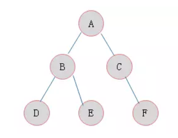

该二叉树节点A到节点D的路径长度为2，节点A到达节点C的路径长度为1。

### 节点的权及带权路径长度

若将树中节点赋给一个有着某种含义的数值，则这个数值称为该**节点的权**。节点的**带权路径长度**为：从根节点到该节点之间的路径长度与该节点的权的乘积。

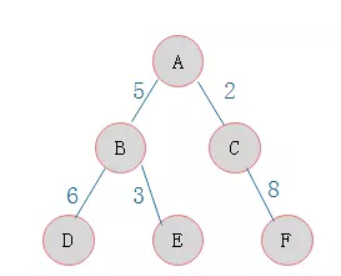

节点D的带权路径长度为：2*6 =18

### 树的带权路径长度

树的**带权路径长度**规定为**所有叶子节点**的**带权路径长度之和**，记为WPL。

上图的WPL = 6 * 2 + 3 * 2 + 8 * 2 = 34。

## 二叉树的性质

* 在二叉树的第i层上至多有2^(i-1)个节点（i>0）。

* 深度为k的二叉树至多有2^k - 1个节点（k>0）。

* 对于任意一棵二叉树，如果其叶节点数为N0，而度数为2的节点总数为N2，则N0=N2+1。

  * 一棵深度k且有2^{k}-1个节点的二叉树称为**满二叉树**。深度为k，节点数为n的二叉树，当且仅当其每一个节点都与深度为k的满二叉树中编号为1至n的节点一一对应时，称之为**完全二叉树**。在下图2中，（a）为满二叉树，（b）为完全二叉树。

    

* 具有n个节点的完全二叉树的深度必为 log2(n+1)。

* 对完全二叉树，若从上至下、从左至右编号，则编号为i 的节点，其左孩子编号必为2i，其右孩子编号必为2i＋1；其双亲的编号必为i/2（i＝1 时为根,除外）。

  * 如果i=1，则节点i是二叉树的根，无双亲；如果i>1,则其双亲节点为1/2。
  * 如果2i>n，则节点i无左孩子；否则其左孩子是节点2i。
  * 如果2i+1>n，则节点i无右孩子；否则其右孩子是节点2i+1。

## **二叉树**的种类

### 完全二叉树

对于一棵二叉树，假设其深度为d(d>1)。除了第d层外，其它各层的节点数目均已达最大值，且第d层所有节点**从左向右连续地紧密排列**，这样的二叉树被称为完全二叉树。


**特点**：

- 叶子节点只能出现在最下层和次下层。

- 最下层的叶子节点集中在树的左部。

- 倒数第二层若存在叶子节点，一定在右部连续位置。

- 如果节点度为1，则该节点只有左孩子，即没有右子树。

- 同样节点数目的二叉树，完全二叉树深度最小。

  **注**：满二叉树一定是完全二叉树，但反过来不一定成立。

### 满二叉树

满二叉树的定义是所有叶节点都在最底层的完全二叉树。


**特点：**

- 叶子只能出现在最下一层。出现在其它层就不可能达成平衡。
- 非叶子节点的度一定是2。
- 在同样深度的二叉树中，满二叉树的节点个数最多，叶子数最多。

### 二叉排序树

二叉排序树（Binary Sort Tree），又称二叉查找树（Binary Search Tree），也称二叉搜索树。二叉排序树或者是一棵空树，或者是具有下列性质的二叉树：

**特点**

* 若左子树不空，则左子树上所有节点的值均小于或等于它的根节点的值；
* 若右子树不空，则右子树上所有节点的值均大于或等于它的根节点的值；
* 左、右子树也分别为二叉排序树；


### 平衡二叉树（AVL树）

**平衡二叉树**（AVL树）：当且仅当任何节点的两棵子树的高度差不大于1的二叉排序树(二叉查找树)；


一棵AVL树有如下必要条件：

* 它必须是二叉查找树。
* 每个节点的左子树和右子树的高度差至多为1。

图一中左边二叉树的节点45的左孩子46比45大，不满足二叉搜索树的条件，因此它也不是一棵平衡二叉树。
右边二叉树满足二叉搜索树的条件，同时它满足条件二，因此它是一棵平衡二叉树。

### 斜树 

**斜树**：所有的节点都只有左子树的二叉树叫左斜树。所有节点都是只有右子树的二叉树叫右斜树。这两者统称为斜树。

- 左斜树

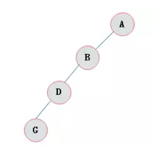

- 右斜树

  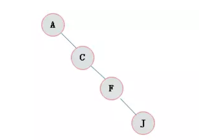

### 霍夫曼树

**霍夫曼树**：给定n个权值作为n个叶子节点，构造一棵二叉树，若带权路径长度达到最小，称这样的二叉树为最优二叉树，也称为霍夫曼树(Huffman Tree)。

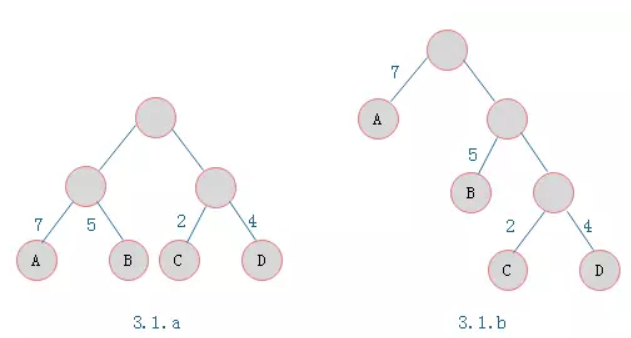

叶子节点为A、B、C、D，对应权值分别为7、5、2、4。
3.1.a树的WPL = 7 * 2 + 5 * 2 + 2 * 2 + 4 * 2 = 36
3.1.b树的WPL = 7 * 1 + 5 * 2 + 2 * 3 + 4 * 3 = 35
由ABCD构成叶子节点的二叉树形态有许多种，但是WPL最小的树只有3.1.b所示的形态。则3.1.b树为一棵霍夫曼树。

**特点：**

* 满二叉树不一定是霍夫曼树。
* 霍夫曼树中权越大的叶子离根越近。
* 具有相同带权节点的霍夫曼树不惟一

#### **构造霍夫曼树**

* 假设有n个权值，则构造出的霍夫曼树有n个叶子节点。 n个权值分别设为 w1、w2、…、wn，则霍夫曼树的构造规则为：

  * 将w1、w2、…，wn看成是有n 棵树的森林(每棵树仅有一个节点)；
  * 在森林中选出两个根节点的权值最小的树合并，作为一棵新树的左、右子树，且新树的根节点权值为其左、右子树根节点权值之和；
  * 从森林中删除选取的两棵树，并将新树加入森林；
  * 重复(2)、(3)步，直到森林中只剩一棵树为止，该树即为所求得的霍夫曼树。

  口诀：

  霍夫曼算法口诀：①构造森林全是根；②选用两小造新树；③删除两小添新人；④重复2、3剩单根。

* 举个例子

  对下图中的六个带权叶子节点来构造一棵霍夫曼树

  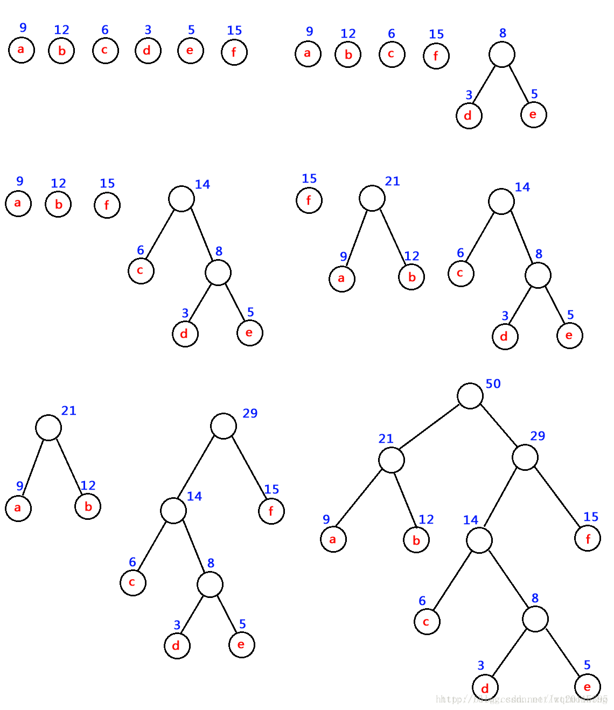


#### **霍夫曼编码**

* 等长编码

  这种编码方式的特点是每个字符的编码长度相同（编码长度就是每个编码所含的二进制位数）。假设字符集只含有4个字符A，B，C，D，用二进制两位表示的编码分别为00，01，10，11。若现在有一段电文为：ABACCDA，则应发送二进制序列：00010010101100，总长度为14位。当接收方接收到这段电文后，将按两位一段进行译码。这种编码的特点是译码简单且具有唯一性，但编码长度并不是最短的。

* 不等长编码

  在传送电文时，为了使其二进制位数尽可能地少，可以将每个字符的编码设计为不等长的，使用频度较高的字符分配一个相对比较短的编码，使用频度较低的字符分配一个比较长的编码。例如，可以为A，B，C，D四个字符分别分配0，00，1，01，并可将上述电文用二进制序列：000011010发送，其长度只有9个二进制位，但随之带来了一个问题，接收方接到这段电文后无法进行译码，因为无法断定前面4个0是4个A，1个B、2个A，还是2个B，即译码不唯一，因此这种编码方法不可使用。

因此，为了设计长短不等的编码，以便减少电文的总长，还必须考虑编码的**唯一性**，即在建立不等长编码时必须使任何一个字符的编码都不是另一个字符的前缀，这宗编码称为前缀编码（prefix code）。

1. 利用字符集中每个字符的使用频率作为权值构造一个霍夫曼树

2. 从根节点开始，为到每个叶子节点路径上的左分支赋予0，右分支赋予1，并从根到叶子方向形成该叶子节点的编码.

#### 霍夫曼树的创建

##### 节点创建

共有5个属性：节点的值，节点的优先度，节点的左子节点，节点的右子节点，节点值的编码

 ```python
# 树节点类构建
class TreeNode(object):
    def __init__(self, data):
        """
        定义霍夫曼树的节点
        :param data:
        """
        self.val = data[0]
        self.priority = data[1]
        self.leftChild = None
        self.rightChild = None
        self.code = ""
 ```

##### 创建树节点队列函数

对于所有的字母节点，我们将其组成一个队列，这里使用list列表来完成队列的功能。将所有树节点够放进列表中，当然传进来的是按优先度从小到大已排序的元素列表

```python
def creatnodeQ(codes):
    """
    创建树节点队列函数
    :param codes:
    :return:
    """
    q = []
    for code in codes:
        q.append(TreeNode(code))
    return q
```

##### 为队列添加节点元素，并保证优先度从大到小排列

当有新生成的节点时，需将其插入列表，并放在合适位置，使队列依然时按优先度从小打到排列的。

```python
def addQ(queue, nodeNew):
    """
    # 为队列添加节点元素，并保证优先度从大到小排列
    :param queue:
    :param nodeNew:
    :return:
    """
    if len(queue) == 0:
        return [nodeNew]
    for i in range(len(queue)):
        if queue[i].priority >= nodeNew.priority:
            return queue[:i] + [nodeNew] + queue[i:]
    return queue + [nodeNew]
```

##### 节点队列类定义

创建类初始化时需要传进去的是一个列表，列表中的每个元素是由字母与优先度组成的元组。元组第一个元素是字母，第二个元素是优先度（即在文本中出现的次数）

类初始化化时，调用“创建树节点队列函数”，队列中的每个元素都是一个树节点。

类中还包含一个队列规模属性以及另外两个操作函数：添加节点函数和弹出节点函数。

添加节点函数直接调用之前定义的函数即可，输入的参数为队列和新节点，并且队列规模加一

弹出第一个元素则直接调用列表的pop(0)函数，同时队列规模减一

```python
class nodeQeuen(object):
    """
    节点队列类定义
    """

    def __init__(self, code):
        self.que = creatnodeQ(code)
        self.size = len(self.que)

    def addNode(self, node):
        self.que = addQ(self.que, node)
        self.size += 1

    def popNode(self):
        self.size -= 1
        return self.que.pop(0)

```

##### 计算文本中个字母的优先度，即出现的次数

定义一个字典，遍历文本中的每一个字母，若字母不在字典里说明是第一次出现，则定义该字母为键，另键值为1，若在字典里有，则只需将相应的键值加一。 遍历后就得到了每个字母出现的次数。

```python
def freChar(string):
    """
    各个字符在字符串中出现的次数，即计算优先度
    :param string:
    :return:
    """
    d = {}
    for c in string:
        if c not in d:
            d[c] = 1
        else:
            d[c] += 1
    return sorted(d.items(), key=lambda x: x[1])
```

##### 创建霍夫曼树

```python
def creatHuffmanTree(nodeQ):
    """
    创建霍夫曼树
    :param nodeQ:
    :return:
    """
    while nodeQ.size != 1:
        node1 = nodeQ.popNode()
        node2 = nodeQ.popNode()
        r = TreeNode([None, node1.priority + node2.priority])
        r.leftChild = node1
        r.rightChild = node2
        nodeQ.addNode(r)
    return nodeQ.popNode()
```

##### 由霍夫曼树得到编码表

这里定义了两个全局字典，用于存放字母编码，一个字典用于编码，另一个字典用于解码，这样程序操作起来比较方便。

这里主要就是遍历，运用的是二叉树的中序遍历。如果明白中序遍历的化，就能看懂这里的代码，每递归到深一层的时候，就在后面多加一个‘0'（左子树）或‘1'（右子树）。

```python
codeDic1 = {}
codeDic2 = {}
def HuffmanCodeDic(head, x):
    """
    由霍夫曼树得到霍夫曼编码表
    :param head:
    :param x:
    :return:
    """
    global codeDic, codeList
    if head:
        HuffmanCodeDic(head.leftChild, x + '0')
        head.code += x
        if head.val:
            codeDic2[head.code] = head.val
            codeDic1[head.val] = head.code
        HuffmanCodeDic(head.rightChild, x + '1')
```

##### 字符串编码，字符串解码

```python
def TransEncode(string):
    """
    字符串编码
    :param string:
    :return:
    """
    global codeDic1
    transcode = ""
    for c in string:
        transcode += codeDic1[c]
    return transcode

def TransDecode(StringCode):
    """
    字符串解码
    :param StringCode:
    :return:
    """
    global codeDic2
    code = ""
    ans = ""
    for ch in StringCode:
        code += ch
        if code in codeDic2:
            ans += codeDic2[code]
            code = ""
    return ans
```

##### 测试

```python
# 测试
string = "Datawhale"

# 统计各个字符在字符串中出现的次数，即计算优先度
f = freChar(string)
print(f)

# 构建节点队列
t = nodeQeuen(f)
print(t)

# 构建霍夫曼树
tree = creatHuffmanTree(t)

# 霍夫曼树得到编码表
HuffmanCodeDic(tree, '')
print(codeDic1, codeDic2)

# 字符串编码
a = TransEncode(string)
print(a)

# 字符串解码
aa = TransDecode(a)
print(aa)

# 判断通过字符串构建的霍夫曼树与根据霍夫曼树解码的字符串是否一致
print(string == aa)
```


### 线索二叉树

#### 线索二叉树由来

当用二叉链表作为二叉树的存储结构时，可以很方便地找到某个节点的左右孩子；但一般情况下，**无法直接找到该节点在某种遍历序列中的前驱和后继节点。**

#### 如何寻找特定遍历序列中二叉树节点的前驱和后继？？？

解决的方法：

* 通过遍历寻找——费时间
* 再增设前驱、后继指针域——增加了存储负担。
* **利用二叉链表中的空指针域。**

#### 二叉树链表中空指针域的数量

具有n个节点的二叉链表中，一共有2n个指针域；因为n个节点中有n-1个孩子，即2n个指针域中，有n-1个用来指示节点的左右孩子，其余n+1个指针域为空。

* 利用二叉链表中的空指针域

  如果某个节点的左孩子为空，则将空的左孩子指针域改为指向其前驱；如果某节点的右孩子为空，则将空的右孩子指针域改为指向其后继，这种改变指向指针称为**线索**，加上了线索的二叉树称为**线索二又树**（Threaded Binary Tree），对二叉树按某种遍历次序使其变为线索二叉树的过程叫**线索化**。

为区分Irchid和rchild指针到底是指向孩子的指针，还是指向前驱或后继的指针，对二叉链表中**每个节点增设两个标志域ltag和rtag**，并约定：

* **Itag=0**	Ichild 指向该节点的**左孩子**
* **Itag=1** 	Ichild 指向该节点的**前驱**
* **rtag=0**	rchild 指向该节点的**右孩子**
* **rtag=1** 	rchild 指向该节点的**后继**

#### 线索二又树的节点结构

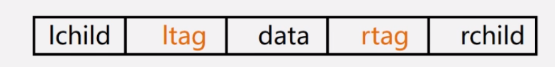

#### 线索二又树的存储结构

* 先序线索二叉树线索化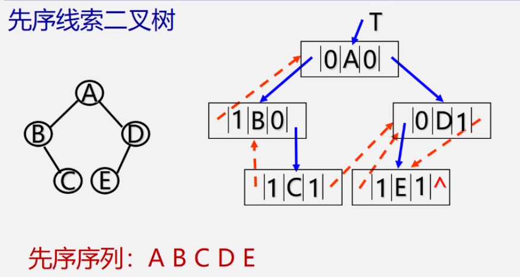

* 中序线索二叉树线索化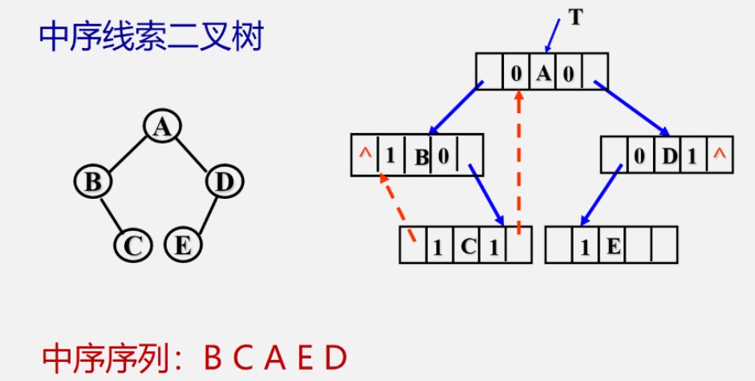

* 后序线索二叉树线索化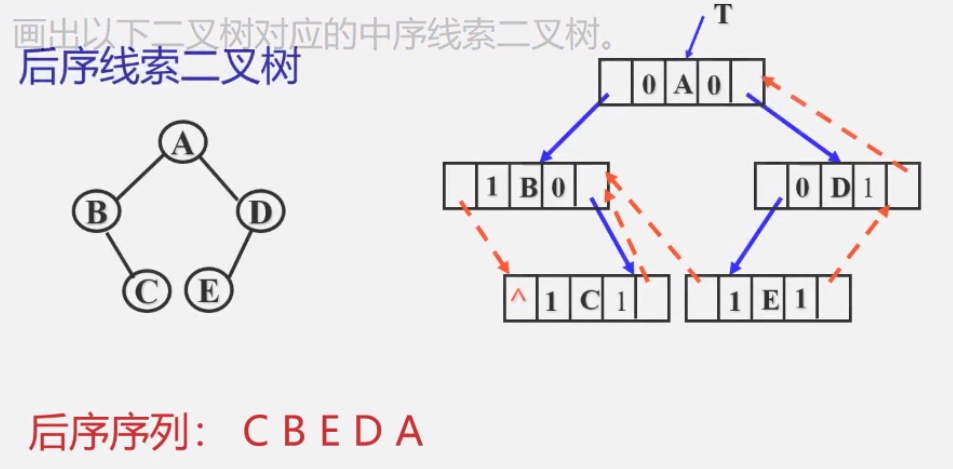

#### 增设头节点的线索二叉树

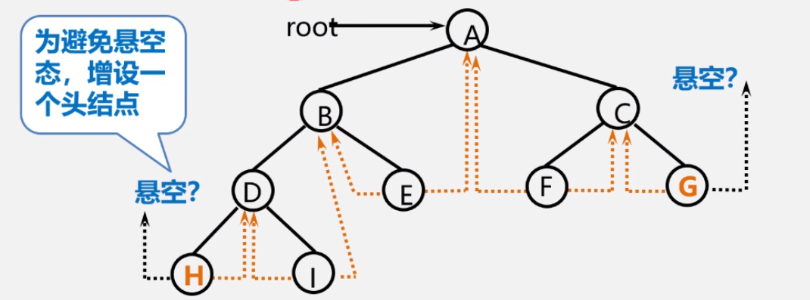

* Itag=0，Ichild指向根节点

* rtag=1，rchild指向遍历序列中最后一个节点

* 遍历序列中第一个节点的Ic域和最后一个节点的rc域都指向头节点

  线索化之后如下图所示：

  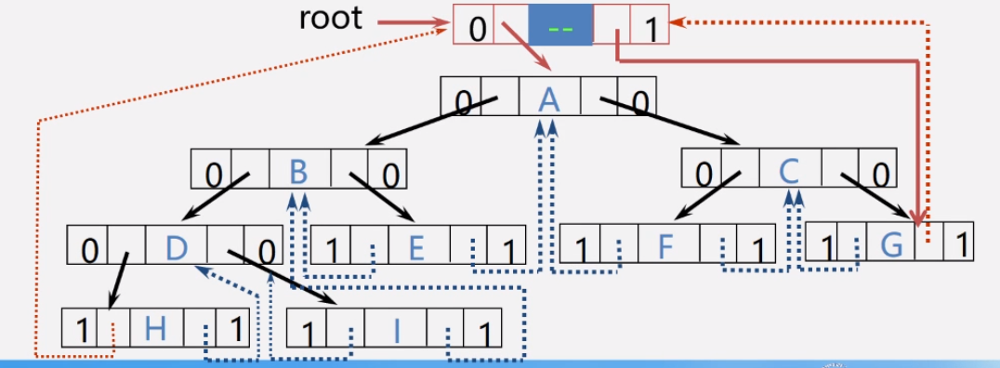


## 二叉树的创建(链表)

### 节点的创建

* 代码思路

  一个二叉树的节点包含数据域，即本身的值，还有左孩子和右孩子。

* 代码实现

  ```python
  class BTree(object):
      def __init__(self, data=None, left=None, right=None):
          """
          定义一个二叉树的节点
          :param data:数据域
          :param left: 左孩子
          :param right: 右孩子
          """
          self.data = data
          self.left = left
          self.right = right
          self.dot = Digraph(comment='Binary Tree')# 绘制节点
  ```

### 判断二叉树是否为空

* 代码实现

  ```python
      def is_empty(self):
          """
          判断二叉树是否为空
          :return:
          """
          return self.data is None
  ```

### 叶子节点

- 代码实现

  ```python
      def leaves(self):
          """
          递归遍历二叉树的节点
          :return:
          """
          if self.data is None:
              return None
          elif self.left is None and self.right is None:
              print(self.data,end = " ")
          elif self.left is None and self.right is not None:
              self.right.leaves()
          elif self.left is not None and self.right is None:
              self.left.leaves()
          else:
              self.left.leaves()
              self.right.leaves()
  ```

### 二叉树的高度

* 代码实现

  ```python
      def height(self):
          """
          二叉树的高度
          空树的高度为0，只有节点的树的高度为1
          :return:
          """
          if self.data is None:
              return 0
          elif self.left is None and self.right is None:
              return 1
          elif self.left is None and self.right is not None:
              return 1 + self.right.height()
          elif self.left is not None and self.right is None:
              return 1 + self.left.height()
          else:
              return 1 + max(self.left.height(), self.right.height())
  
  ```

  

## 二叉树的遍历

**先、中、后**均指的是根节点的遍历先后顺序，遍历子节点的时候都是**先左后右**。

### 先序遍历

若二叉树为空，为空操作；否则

1. 访问根节点；
2. 先序遍历左子树；
3. 先序遍历右子树。

* 代码实现

  ```python
      def preorder(self, root):
          """
          递归实现先序遍历 
          :param root:
          :return:
          """
          if root is None:
              return
          print(root.item, end=" ")
          self.preorder(root.left)
          self.preorder(root.right)
  ```

### 中序遍历

若二叉树为空，为空操作；否则

1. 中序遍历左子树；
2. 访问根节点；
3. 中序遍历右子树。

* 代码实现

  ```python
      def inorder(self, root):
          """
          递归实现中序遍历
          :param root:
          :return:
          """
          if root is None:
              return
          self.inorder(root.left)
          print(root.item, end=" ")
          self.inorder(root.right)
  ```

###　后序遍历

若二叉树为空，为空操作；否则

1. 后序遍历左子树；
2. 后序遍历右子树；
3. 访问根节点。

* 代码实现

  ```python
      def postorder(self, root):
          """
          递归实现后序遍历
          :param root:
          :return:
          """
          if root is None:
              return
          self.postorder(root.left)
          self.postorder(root.right)
          print(root.item, end=" ")
  ```

  

### 深度优先遍历

若二叉树为空，为空操作；对每一个可能的分支路径深入到不能再深入为上，而且每个节点只能访问一次。

* 代码实现

### 广度优先遍历(层序遍历)

若二叉树为空，为空操作；否则从上到下、从左到右按层次进行访问。

* 代码实现

  ```python
      def levelorder(self):
          """
          层序遍历
          :return:
          """
          if self is None:
              return
          queue = [self]
          while queue:
              cur_node = queue.pop(0)
              print(cur_node.data, end=" ")
              if cur_node.left is not None:
                  queue.append(cur_node.left)
              if cur_node.right is not None:
                  queue.append(cur_node.right)
  ```

### 绘制二叉树

* 代码实现

  ```python
      def print_tree(self, save_path='./Binary_Tree.gv', label=False):
          """
          利用Graphviz实现二叉树的可视化
          :param save_path:文件保存路径
          :param label: 标签
          :return:
          """
          # colors for labels of nodes
          colors = [
              'skyblue',
              'tomato',
              'orange',
              'purple',
              'green',
              'yellow',
              'pink',
              'red']
  
          # 绘制以某个节点为根节点的二叉树
          def print_node(node, node_tag):
              # 节点颜色
              color = sample(colors, 1)[0]
              if node.left is not None:
                  left_tag = str(uuid.uuid1())            # 左节点的数据
                  self.dot.node(left_tag, str(node.left.data),
                                style='filled', color=color)    # 左节点
                  label_string = 'L' if label else ''    # 是否在连接线上写上标签，表明为左子树
                  self.dot.edge(
                      node_tag,
                      left_tag,
                      label=label_string)   # 左节点与其父节点的连线
                  print_node(node.left, left_tag)
  
              if node.right is not None:
                  right_tag = str(uuid.uuid1())
                  self.dot.node(right_tag, str(node.right.data),
                                style='filled', color=color)
                  label_string = 'R' if label else ''  # 是否在连接线上写上标签，表明为右子树
                  self.dot.edge(node_tag, right_tag, label=label_string)
                  print_node(node.right, right_tag)
  
          # 如果树非空
          if self.data is not None:
              root_tag = str(uuid.uuid1())   # 根节点标签
              self.dot.node(
                  root_tag, str(
                      self.data), style='filled', color=sample(
                      colors, 1)[0])     # 创建根节点
              print_node(self, root_tag)
  
          self.dot.render(save_path)    # 保存文件为指定文件
  ```

### 测试

* 代码实现

  ```python
  if __name__ == '__main__':
  
      # 构造二叉树
      right_tree = BTree(6)
      right_tree.left = BTree(2)
      right_tree.right = BTree(4)
  
      left_tree = BTree(5)
      left_tree.left = BTree(1)
      left_tree.right = BTree(3)
  
      tree = BTree(11)
      tree.left = left_tree
      tree.right = right_tree
  
      left_tree = BTree(7)
      left_tree.left = BTree(3)
      left_tree.right = BTree(4)
  
      right_tree = tree  # 增加新的变量
      tree = BTree(18)
      tree.left = left_tree
      tree.right = right_tree
  
      print('先序遍历为:')
      tree.preorder()
      print()
  
      print('中序遍历为:')
      tree.inorder()
      print()
  
      print('后序遍历为:')
      tree.postorder()
      print()
  
      print('层序遍历为:')
      tree.levelorder()
      print()
  
      height = tree.height()
      print('树的高度为%s.' % height)
  
      print('叶子节点为：')
      tree.leaves()
      print()
  
  
      tree.print_tree(save_path='./BTree.gv', label=True)
      print("二叉树已保存")
  ```

* 测试结果

  ```python
  先序遍历为:
  18 7 3 4 11 5 1 3 6 2 4 
  中序遍历为:
  3 7 4 18 1 5 3 11 2 6 4 
  后序遍历为:
  3 4 7 1 3 5 2 4 6 11 18 
  层序遍历为:
  18 7 11 3 4 5 6 1 3 2 4 
  树的高度为4.
  叶子节点为：
  3 4 1 3 2 4 
  二叉树已保存
  ```

  

* 构造的二叉树如下：

  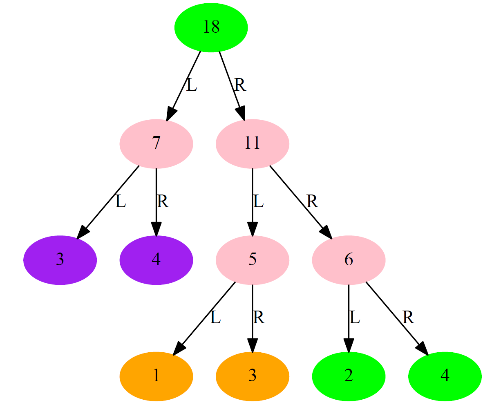

## 二叉树的创建(顺序表)

* 代码实现

  ```python
  def create_BTree_By_List(array):
  
      i = 1
      # 将原数组拆成层次遍历的数组，每一项都储存这一层所有的节点的数据
      level_order = []
      sum = 1
  
      while sum < len(array):
          level_order.append(array[i-1:2*i-1])
          i *= 2
          sum += i
      level_order.append(array[i-1:])
      # print(level_order)
  
      # BTree_list: 这一层所有的节点组成的列表
      # forword_level: 上一层节点的数据组成的列表
      def Create_BTree_One_Step_Up(BTree_list, forword_level):
  
          new_BTree_list = []
          i = 0
          for elem in forword_level:
              root = BTree(elem)
              if 2*i < len(BTree_list):
                  root.left = BTree_list[2*i]
              if 2*i+1 < len(BTree_list):
                  root.right = BTree_list[2*i+1]
              new_BTree_list.append(root)
              i += 1
  
          return new_BTree_list
  
      # 如果只有一个节点
      if len(level_order) == 1:
          return BTree(level_order[0][0])
      else: # 二叉树的层数大于1
  
          # 创建最后一层的节点列表
          BTree_list = [BTree(elem) for elem in level_order[-1]]
  
          # 从下往上，逐层创建二叉树
          for i in range(len(level_order)-2, -1, -1):
              BTree_list = Create_BTree_One_Step_Up(BTree_list, level_order[i])
  
          return BTree_list[0]
  ```

* 测试

  ```python
  array = list(range(1,16))
  # array = 'ABCDEFGHIJKLMNOPQRSTUVWXYZ'
  tree = create_BTree_By_List(array)
  
  print('先序遍历为:')
  tree.preorder()
  print()
  
  height = tree.height()
  print('\n树的高度为%s.\n'%height)
  
  print('层序遍历为:')
  level_order = tree.levelorder()
  print(level_order)
  print()
  
  print('叶子节点为：')
  tree.leaves()
  print()
  
  # 利用Graphviz进行二叉树的可视化
  tree.print_tree(save_path='./create_btree_by_list.gv', label=True)
  ```

* 测试结果

  ```python
  先序遍历为:
  1 2 4 8 9 5 10 11 3 6 12 13 7 14 15 
  
  树的高度为4.
  
  层序遍历为:
  [[1], [2, 3], [4, 5, 6, 7], [8, 9, 10, 11, 12, 13, 14, 15]]
  
  叶子节点为：
  8 9 10 11 12 13 14 15 
  ```

  


# 参考资料

二叉树的Python实现：https://mp.weixin.qq.com/s/kmTDlq4gNmAeH5SDfhdoGA

二叉查找树（BST)、平衡二叉树(AVL树): https://www.cnblogs.com/sgatbl/p/9426394.html

深入学习二叉树(一) 二叉树基础：https://www.jianshu.com/p/bf73c8d50dc2

深入学习二叉树(二) 线索二叉树：https://www.jianshu.com/p/3965a6e424f5

深入学习二叉树(三) 霍夫曼树：https://www.jianshu.com/p/5ad3e97d54a3

深入学习二叉树(四) 二叉排序树：https://www.jianshu.com/p/bbe133625c73

 小甲鱼数据结构与算法：https://www.bilibili.com/video/av2975983?from=search&seid=9609762438302042957