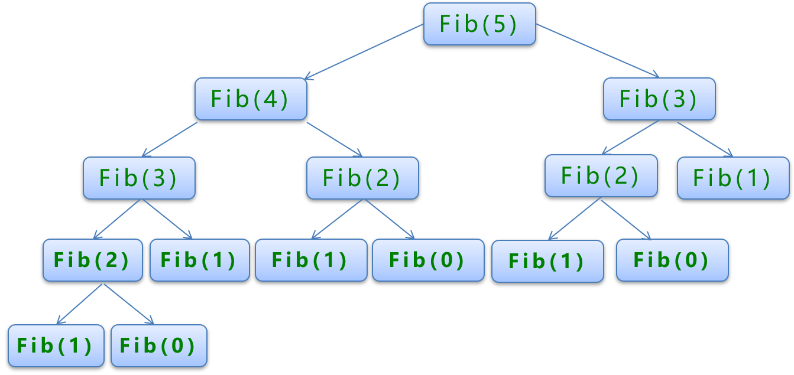
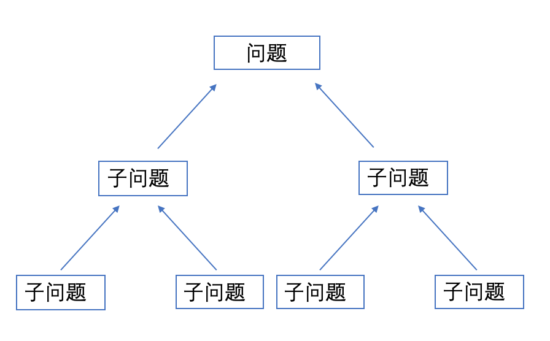

# 递归与分治

## 递归(Recursion)

### 主要思想

递归(Recursion)是指在函数的定义中使用函数自身的方法，即自己调用自己。递归是有去(递)有回(归)的，”递“和“归”，这正是递归思想的精华所在。

“有去”是指：递归问题必须可以分解为若干个规模较小，与原问题形式相同的子问题，这些子问题可以用相同的解题思路来解决，就像上面例子中的钥匙可以打开后面所有门上的锁一样；

“有回”是指 : 这些问题的演化过程是一个从大到小，由近及远的过程，并且会有一个明确的终点(临界点)，一旦到达了这个临界点，就不用再往更小、更远的地方走下去。最后，从这个临界点开始，原路返回到原点，原问题解决。　　

### no pic say a jb


### 递归三要素

* 明确递归终止条件；
  * 递归就是有去有回，既然这样，那么必然应该有一个明确的临界点，程序一旦到达了这个临界点，就不用继续往下递去而是开始实实在在的归来。换句话说，该临界点就是一种简单情境，可以防止无限递归。
* 给出递归终止时的处理办法；
  * 递归的临界点存在一种简单情境，在这种简单情境下，我们应该直接给出问题的解决方案。一般地，在这种情境下，问题的解决方案是直观的、容易的。
* 提取重复的逻辑，缩小问题规模。
  * 递归问题必须可以分解为若干个规模较小、与原问题形式相同的子问题，这些子问题可以用相同的解题思路来解决。从程序实现的角度而言，我们需要抽象出一个干净利落的重复的逻辑，以便使用相同的方式解决子问题。

### 伪代码

* 代码实现

  ```python
  def recursion(level, paraml, param2,...):
      # 递归的终止条件 绝对不能掉，否则陷入死循环
      if level> MAX_LEVEL:
          print_result
          return
      # 在当前递归层处理数据
      process_data(level, data...)
      # 下到更深层的递归，层数+1 参数更新
      self. recursion(level+1,p1,...)
      # 根据实际情况判断决定是否需要返回
      reverse_state(level)
  ```

### 算法应用

#### 斐波那契数列(leetcode509)

* 题目

  斐波那契数，通常用 F(n) 表示，形成的序列称为斐波那契数列。该数列由 0 和 1 开始，后面的每一项数字都是前面两项数字的和。也就是：

  ```python
  F(0) = 0,   F(1) = 1
  F(N) = F(N - 1) + F(N - 2), 其中 N > 1.
  ```

  给定 N，计算 F(N)。

  示例 1：

  ```python
  输入：2
  输出：1
  解释：F(2) = F(1) + F(0) = 1 + 0 = 1.
  ```


  示例 2：

  ```python
  输入：3
  输出：2
  解释：F(3) = F(2) + F(1) = 1 + 1 = 2.
  ```


  示例 3：

  ```python
  输入：4
  输出：3
  解释：F(4) = F(3) + F(2) = 2 + 1 = 3.
  ```


  提示：0 ≤ N ≤ 30


* 递归实现

  

* 代码实现

  ```python
  class Solution(object):
      def fib(self, N):
          """
          使用递归
          :type N: int
          :rtype: int
          """
          # 递归的终止条件 绝对不能掉，否则陷入死循环
          if N == 0 or N == 1:
              return N
          # 在当前递归层处理数据
          result = self.fib(N-2) + self.fib(N-1)
          return result
      def fib(self, N):
          """
          直接相加
          :type N: int
          :rtype: int
          """
          a,b = 0,1
          for i in range(N):
              a,b = b,a+b
          return a
  ```

* 执行结果

  * 递归

    ```python
    执行用时 :1012 ms, 在所有 Python 提交中击败了16.11%的用户
    内存消耗 :11.7 MB, 在所有 Python 提交中击败了36.06%的用户
    ```

  * 直接相加

    ```python
    执行用时 :24 ms, 在所有 Python 提交中击败了69.31%的用户
    内存消耗 :11.9 MB, 在所有 Python 提交中击败了7.81%的用户
    ```

  * 执行耗时时间最短代码

    ```python
    就是直接相加
    ```

## 分治

### 主要思想

分治算法的主要思想是将原问题分成若干个子问题，解决这些子问题再最终合并出原问题的答案。在计算过程中，子问题会被递归地分成更小的子问题，直到子问题满足边界条件。最后，算法会层层递回原问题的答案。

1. 分-将问题分解为规模各个的子问题；
2. 治-将这些规模更小的子问题逐个击破；
3. 合-将已解决的子问题合并，最终得出“母”问题的解；
4. 减而治之（每次让问题的规模减1）
5. 分而治之（每次让问题的规模减半）（归并排序的思想）

### no pic say a jb



### 分治算法的步骤

- 将原问题分解成若干个性质相同的、相互独立的子问题。
- 递归地解决各子问题，直到子问题小到可以直接被解决。
- 逐层合并子问题的解，得到原问题的解。

判断一个问题能否用分治算法解决时，先看原问题能否被分解成更小的子问题。如果能，再看子问题的结构和性质是否与原问题一样。如果一样，那么问题很有可能能够用分治算法解决。

### 伪代码

```python
def divide_conquer(problem, paraml, param2,...):
    # 不断切分的终止条件
    if problem is None:
        print_result
        return
    # 准备数据
    data=prepare_data(problem)
    # 将大问题拆分为小问题
    subproblems=split_problem(problem, data)
    # 处理小问题，得到子结果
    subresult1=self.divide_conquer(subproblems[0],p1,..…)
    subresult2=self.divide_conquer(subproblems[1],p1,...)
    subresult3=seLf.divide_conquer(subproblems[2],p1,.…)
    # 对子结果进行合并 得到最终结果
    result=process_result(subresult1, subresult2, subresult3,...)
```

### 算法应用

#### 求众数(leetcode169)

* 题目

  给定一个大小为 n 的数组，找到其中的众数。众数是指在数组中出现次数大于 ⌊ n/2 ⌋ 的元素。

  你可以假设数组是非空的，并且给定的数组总是存在众数。

  示例 1:

  ```python
  输入: [3,2,3]
  输出: 3
  ```

  示例 2:

  ```python
  输入: [2,2,1,1,1,2,2]
  输出: 2
  ```

* Solution

  ```python
  class Solution(object):
      def majorityElement1(self, nums):
          """
          不使用分治，只用条件：众数是指在数组中出现次数大于 ⌊ n/2 ⌋ 的元素。
          :type nums: List[int]
          :rtype: int
          """
          nums.sort()
          return nums[len(nums)//2]
      def majorityElement2(self, nums):
          """
          :type nums: List[int]
          :rtype: int
          """
          # 不断切分的终止条件
          if not nums:
              return None
          if len(nums) == 1:
              return nums[0]
          # 准备数据，并将大问题拆分为小问题
          left = self.majorityElement(nums[:len(nums)//2])
          right = self.majorityElement(nums[len(nums)//2:])
          # 处理小问题，得到子结果
          # 对子结果进行合并 得到最终结果
          if left == right:
              return left
          if nums.count(left) > nums.count(right):
              return left
          else:
              return right    
  ```

  执行结果

  - 递归

    ```python
    执行用时 :180 ms, 在所有 Python 提交中击败了92.39%的用户
    内存消耗 :13.3 MB, 在所有 Python 提交中击败了11.62%的用户
    ```

  - 分治

    ```python
    执行用时 :344 ms, 在所有 Python 提交中击败了9.10%的用户
    内存消耗 :13.2 MB, 在所有 Python 提交中击败了26.93%的用户
    ```

  - 执行耗时时间最短代码：用时为 136 ms 的范例

    ```python
    class Solution(object):
        def majorityElement(self, nums):
            """
            :type nums: List[int]
            :rtype: int
            """
            dic = {}
            for i in nums:
                if i not in dic:
                    if nums.count(i) > len(nums)//2:
                        return i
                    else:
                        dic[i] = 1
    ```

## 参考资料

递归算法讲解：https://blog.csdn.net/sinat_38052999/article/details/73303111

你不知道的 Python 分治算法：https://gitchat.csdn.net/activity/5d39b22ba2a28a54fc0090f7?utm_source=so#1?utm_source=so&utm_source=so