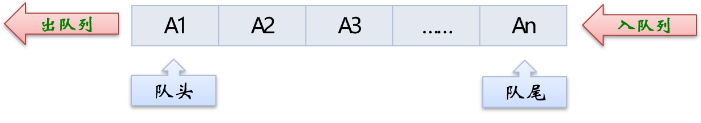
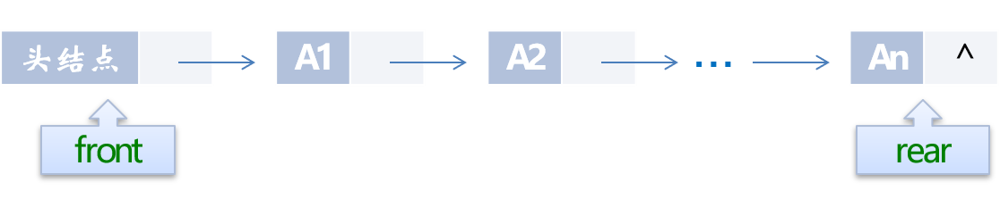
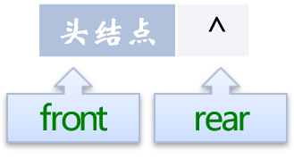
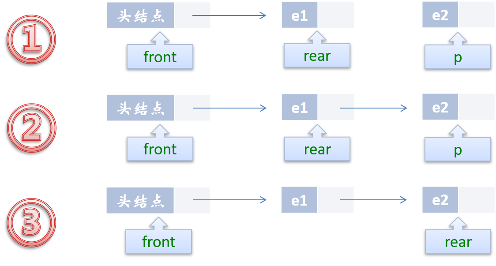
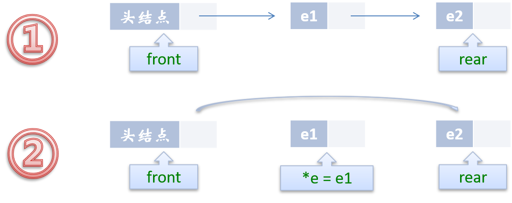
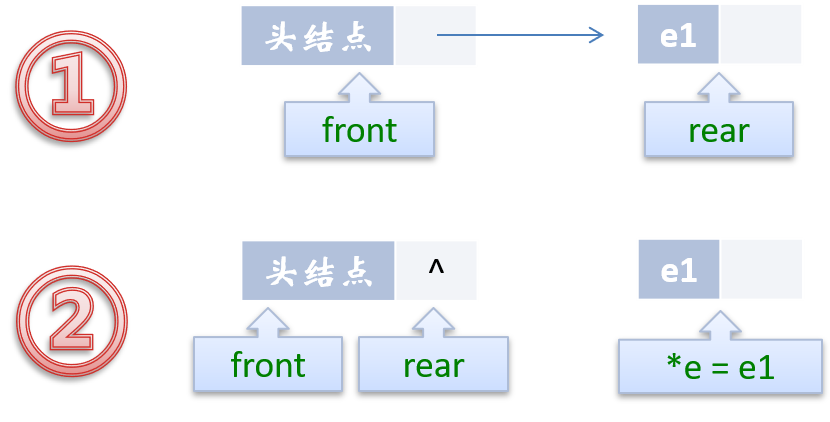
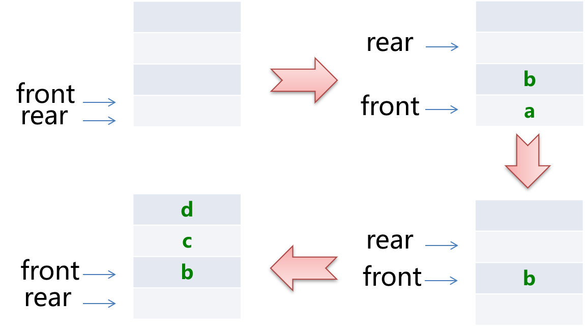

# 队列


## 队列的定义

队列（queue）是只允许在一端进行插入操作，而在另一端进行删除操作的线性表。与栈相反，队列是一种先进先出（First In First Out, FIFO）的线性表。与栈相同的是，队列也是一种重要的线性结构，实现一个队列同样需要顺序表或链表作为基础。



## 队列的存储结构

### 队列的链式存储结构

队列既可以用链表实现，也可以用顺序表实现。跟栈相反的是，栈一般我们用顺序表来实现，而队列我们常用链表来实现，简称为链队列。

我们将队头指针指向链队列的头结点，而队尾指针指向终端结点。（注：头结点不是必要的，但为了方便操作，我们加上了。）



空队列时，front和rear都指向头结点。



#### 创建一个队列

创建一个队列要完成两个任务：一是在内存中创建一个头结点，二是将队列的头指针和尾指针都指向这个生成的头结点，因为此时是空队列。

* 代码实现

  ```python
  class Node(object):
      """
      定义一个节点
      """
      def __init__(self,item):
          self.data = item
          self.next = None
  
  class Queue(object):
      """
      用链表实现队列
      """
      def __init__(self,node = None):
          self.__head = node
          self.end = None # 用于尾部入列
  ```

  

#### 入队列操作



* 代码实现

  ```python
      def enqueue(self,item):
          """
          入队列，把元素压入队尾
          :param item:
          :return:
          """
          node = Node(item)
          if self.isEmpty():
              self.__head = node
              self.end = node
          else:
              self.end.next = node
              self.end = node
  ```

  

#### 出队列操作

出队列操作是将队列中的第一个元素移出，队头指针不发生改变，改变头结点的next指针即可。



如果原队列只有一个元素，那么我们就应该处理一下队尾指针。 



* 代码实现

  ```python
      def dequeue(self):
          """
          出队列，讲队首元素弹出
          :return:
          """
          if self.isEmpty():
              print("队列为空！！！")
          else:
              end = self.__head.data
              self.__head = self.__head.next
              return end
  ```

  

####　判断队列是否为空

* 代码实现

  ```python
      def isEmpty(self):
          """
          判断队列是否为空
          :return:
          """
          return self.__head == None
  
  ```

#### 返回队列的长度

* 代码实现

  ```python
      def size(self):
          """
          判断队列的长度
          :return:
          """
          # cur 游标，用来移动遍历节点
          cur = self.__head
          # count记录数量
          count = 0
          while cur != None:
              count += 1
              cur = cur.next
          return count
  ```

  


#### 测试

* 代码实现

  ```python
  if __name__ == '__main__':
  
      # 实例化队列
      que = Queue()
  
      # 判断队列是否为空
      print("队列是否为空:%s" % que.isEmpty())# 判断队列是否为空:True
  
      # 入队列
      que.enqueue(1)
      que.enqueue(2)
      que.enqueue(3)
      que.enqueue(4)
  
      # 判断队列是否为空
      print("判断队列是否为空:%s" % que.isEmpty())# 判断队列是否为空:False
  
      # 查看队列大小
      print("队列大小:%s" % que.size())# 队列大小:4
  
      # 查看队尾元素
      print("队尾元素:%s" % que.getRear())# 队尾元素:4
  
      # 查看队首元素
      print("队首元素:%s" % que.getFront())# 队首元素:1
  
      # 出队列
      print("当前出队列元素:%s" % que.dequeue())# 当前出队列元素:1
      print("当前出队列元素:%s" % que.dequeue())# 当前出队列元素:2
      print("当前出队列元素:%s" % que.dequeue())# 当前出队列元素:3
      print("当前出队列元素:%s" % que.dequeue())# 当前出队列元素:4
  
      # 判断队列是否为空
      print("队列是否为空:%s" % que.isEmpty())# 队列是否为空:True
  ```

  


### 队列的顺序存储结构

我们假设一个队列有n个元素，则顺序存储的队列需建立一个大于n的存储单元，并把队列的所有元素存储在数组的前n个单元，数组下标为0的一端则是队头。

#### 使用列表实现一个队列

* 代码实现

  ```python
  class Queue(object):
      """
      队列
      """
      def __init__(self):
          """
          创建空的队列
          """
          self.items = []
  ```

#### 判断是否为空

* 代码实现

  ```python
      def isEmpty(self):
          """
          判断队列是否为空
          :return:
          """
          return self.items == []
  ```

  

#### 入队列操作

入队列操作其实就是在队尾追加一个元素，不需要任何移动，时间复杂度为O(1)。

.png)

* 代码实现

  ```python
      def enqueue(self,item):
          """
          入队列
          :param item: 进队列的元素
          :return:
          """
          self.items.append(0,item)
  ```

  

#### 出队列操作

出队列则不同，因为我们已经架设下标为0的位置是队列的队头，因此每次出队列操作所有元素都要向前移动。

.png)

* 代码实现

  ```python
      def dequeue(self):
          """
          出队列
          :return:
          """
          return self.items.pop()
  ```

#### 返回队列的大小

* 代码实现

  ```python
      def size(self):
          """
          队列的大小
          :return:
          """
          return len(self.items)
  ```

#### 测试

```python
if __name__ == '__main__':
    # 实例化队列
    queue = Queue()

    # 判断队列是否为空
    print(queue.isEmpty()) # True

    # 入队列
    queue.enqueue(1)
    queue.enqueue(2)
    queue.enqueue(3)
    queue.enqueue(4)

    # 查看队列的大小
    print(queue.size())# 4

    # 判断队列是否为空
    print(queue.isEmpty())

    # 出队列
    print(queue.dequeue())# 4
    print(queue.dequeue())# 3
    print(queue.dequeue())# 2
    print(queue.dequeue())# 1

 
    # 判断队列是否为空
    print(queue.isEmpty())
```


### 循环队列

循环队列它的容量是固定的，并且它的队头和队尾指针都可以随着元素入出队列而发生改变，这样循环队列逻辑上就好像是一个环形存储空间。队列的存储结构中使用的最多的是循环队列。循环队列包括两个指针， front 指针指向队头元素， rear 指针指向队尾元素的下一个位置。

* 队列为空的判断条件是：**front == rear**

* 队列满的判断条件是：**(rear+1)%maxsize == front**

* 队列长度的计算公式：**(rear-front+maxsize)%maxsize**

但要注意的是，在实际的内存当中，不可能有真正的环形存储区，我们只是用顺序表模拟出来的逻辑上的循环。



#### 创建一个循环队列

* 代码实现

  ```python
  class loopqueue(object):
      def __init__(self, capacity=10):
          """
          构造函数
          :param maxsize: 队列默认的容量为 10
          """
          self.maxsize = capacity + 1  # 队列的初始容量为capacity，对于内部实现，需要满足队列判空与判满的奇异性，
          # 当self.rear + 1 = self.front时，即队列判定为满，此时还剩余一个空间
          self.front = 0  # 队首索引
          self.rear = 0  # 队尾索引
          self.data = [None] * self.maxsize  # 初始化队列的容量
  ```

#### 判断循环队列是否为空

* 代码实现

  ```python
      def isEmpty(self):
          """
          判断队列是否为空
          :return:
          """
          return self.front == self.rear  # 判空
  ```

#### 当前循环队列的大小

* 代码实现

  ```python
      def Capacity(self):
          """
          当前循环队列的大小
          :return:
          """
          return self.maxsize - 1  # 有效元素个数
  ```

#### 查看队列的大小

* 代码实现

  ```python
      def size(self):
          """
          循环队列中有效元素的个数
          :return:
          """
          resize = None  # 要返回的size
          if self.rear >= self.front:  # 队尾的索引在队首的索引后面(包含等于)
              resize = self.rear - self.front
          else:
              resize = self.maxsize - (self.front - self.rear)
          return resize
  ```

#### 入队列操作

* 代码实现

  ```python
      def enqueue(self, item):
          """
          入队列操作
          :param item:
          :return:
          """
          if (self.rear + 1) % self.maxsize == self.front:  # 队列已满
              self._resize(self.Capacity() * 2)  # 队列有效容量扩大两倍
          self.data[self.rear] = item  # 将item放到 self.rear
          self.rear = (self.rear + 1) % self.maxsize  # 维护self.rear,循环队列 要对全体空间取余
  
  ```

#### 出队列操作

* 代码实现

  ```python
      def dequeue(self):
          """
          循环队列出队
          :return:
          """
          if self.isEmpty():
              raise Exception("This queue is empty!!!")
          ret_value = self.data[self.front]  # 记录队首元素
          self.data[self.front] = None  # 将队首元素值空
          # 维护self.front 直接加1，要对全体空间取余
          self.front = (self.front + 1) % self.maxsize
          if self.size() and self.maxsize // self.size() == 4:  # 队列不为空且有效元素个数为可容纳元素的四分之一时，缩容
              self._resize(self.Capacity() // 2)  # 缩容为原先的二分之一
          return ret_value
  ```

#### 查看队首元素

* 代码实现

  ```python
      def getFront(self):
          """
          获取队首元素
          :return:
          """
          if self.isEmpty():
              raise Exception("This queue is empty!!!")
          return self.data[self.front]
  ```

#### 遍历循环队列

* 代码实现

  ```python
      def travel(self):
          """
          遍历循环队列的有效元素
          :return:
          """
          print("loopqueue:Front-- ", end="")
          index = self.front  # 从队首开始
          while index != self.rear:  # 没有到队尾一直遍历
              if index + 1 != self.rear:
                  print(self.data[index], end=" ")  # 打印当前元素
                  index = (index + 1) % self.maxsize
                  # index向后推进，注意是循环队列，到self.data的尾部就要返回到0索引处哦，
                  # 所以要对真实的存储空间取余，而不是对self.Capacity()取余！这么做就错了！
              else:
                  print(self.data[index], end=" ")
                  break
          print("--rear")
          print("size : %d , Capacity : %d" % (self.size(), self.Capacity()))
  
  ```

#### 队列扩/缩容

* 代码实现

  ```python
      def _resize(self, capacity):
          """
          循环队列扩/缩容(真正的self.maxsize应该是capacity+1，才能容纳capacity这么多元素)
          :param capacity:
          :return:
          """
          # 此时不能先做self.maxsize = capacity + 1 。因为后面要将当前队列中的元素全部取出来，一旦
          # self.rear在self.front的前面，而self.maxsize已经改变，就不能全部取出来了！好好想一下～以前就进过坑
  
          tmp_list = [None] * (capacity + 1)
          index = self.front  # 准备开始遍历原先的self.data，转移元素！从self.front开始
          while index != self.rear:  # 若index一直没到self.rear，就继续往后
              # 注意在这里我把原先的元素都放到新list的以索引零开始的地方顺序的放置元素
              tmp_list[index - self.front] = self.data[index]
              index = (index + 1) % self.maxsize  # index往后移，注意循环队列的性质。
          self.data = tmp_list  # 更新self.data为新的那个数据，tmp_list会被自动垃圾回收的，不用担心它。
  
          self.rear = self.size()  # 维护self.rear。就是 0 + self.size()。因为转移元素并不改变size
          self.front = 0  # 维护self.front，因为我是从零开始放的，所以置零。
  
          self.maxsize = capacity + 1  # 最后再维护self.maxsize！讲过了，前面的很多操作依赖于原先的最大容量，等他们都ok了，最后维护这个
  
  
  ```

#### 测试

* 代码实现

  ```python
  if __name__ == '__main__':
      # 实例化循环队列
      lq = loopqueue()
  
      # 判断循环队列是否为空
      print(lq.isEmpty())
  
      # 往队列添加元素
      print("入队18次")
      for i in range(18):
          lq.enqueue(i)
  
      # 判断循环队列是否为空
      print(lq.isEmpty())
  
      # 查看对首元素
      print("front:", lq.front)
  
      # 查看队尾元素
      print("rear:", lq.rear)
  
      # 遍历队列有效元素
      print("遍历队列有效元素：", end=" ")
      lq.travel()
  
      # 出队列
      print("出队15次")
      docker = []
      for i in range(15):
          docker.append(lq.dequeue())
          print("steps : %d, front : %d, rear: %d, size: %d, capacity: %d " %
                (i + 1, lq.front, lq.rear, lq.size(), lq.Capacity()))
  
      # 查看出队列元素
      print("出队元素：", docker)
      print("队列元素打印：", end="")
  ```

  

### 双端队列

双端队列中的元素可以从两端弹出，其限定插入和删除操作在表的两端进行。双端队列可以在队列任意一端入队和出队。


#### 创建一个双端队列

* 代码实现

  ```python
  class Deque(object):
      """双端队列"""
      def __init__(self):
          self.items = []
  ```

#### 判断队列是否为空

* 代码实现

  ```python
      def is_empty(self):
          """
          判断队列是否为空
          :return:
          """
          return self.items == []
  ```

#### 入队列操作(队首)

* 代码实现

  ```python
      def add_front(self, item):
          """
          入队列操作(队首)
          :param item:
          :return:
          """
          self.items.insert(0,item)
  ```

#### 入队列操作(队尾)

* 代码实现

  ```python
      def add_rear(self, item):
          """
          入队列操作(队尾)
          :param item:
          :return:
          """
          self.items.append(item)
  ```

#### 出队列操作(队首)

* 代码实现

  ```python
      def remove_front(self):
          """
         出队列操作(队首)
          :return:
          """
          return self.items.pop(0)
  ```

#### 出队列操作(队尾)

* 代码实现

  ```python
      def remove_rear(self):
          """
          出队列操作(队尾)
          :return:
          """
          return self.items.pop()
  ```

#### 返回队列大小

* 代码实现

  ```python
      def size(self):
          """
          返回队列大小
          :return:
          """
          return len(self.items)
  ```

#### 测试

* 代码实现

  ```python
  if __name__ == "__main__":
      # 实例化双端队列
      deque = Deque()
  
      # 判断队列是否为空
      print(deque.is_empty()) # True
  
      # 入队列操作(队首)
      deque.add_front(1)
      deque.add_front(2)
      # 入队列操作(队尾)
      deque.add_rear(3)
      deque.add_rear(4)
  
      # 判断队列是否为空
      print(deque.is_empty())
      
      # 查看队列大小
      print(deque.size()) # 4
      
      # 出队列操作(队首)
      print(deque.remove_front()) # 2
      print(deque.remove_front()) # 1
      
      # 出队列操作(队尾)
      print(deque.remove_rear()) #  4
      print(deque.remove_rear()) # 3
      
      # 判断队列是否为空
      print(deque.is_empty()) # True
```
  

## 参考资料

Annihilation7的博客：https://blog.csdn.net/Annihilation7/article/details/82847774

小甲鱼数据结构与算法：https://www.bilibili.com/video/av2975983/?p=30

数据结构与算法全套精讲：https://www.bilibili.com/video/av50524094/?p=16